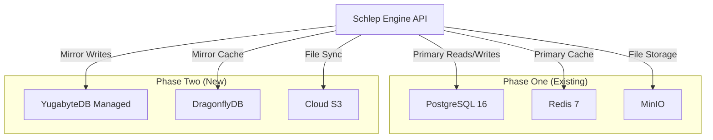

# Phase Two Migration Strategy: PostgreSQL + Redis → YugabyteDB + DragonflyDB

## Executive Summary

This document outlines the migration strategy from Phase One (PostgreSQL + Redis) to Phase Two (YugabyteDB + DragonflyDB) for Schlep Engine. The migration is designed to be **zero-downtime** and **cost-optimized**, targeting enterprise-scale workloads of 10,000+ concurrent users.

**Timeline**: 2-4 weeks
**Downtime**: Zero (rolling migration)
**Data Loss Risk**: None (with proper validation)
**Cost Impact**: +$500-800/month in Phase Two

---

## Migration Overview

### Current Architecture (Phase One)
- **Primary Database**: PostgreSQL 16 (single instance, self-hosted)
- **Cache Layer**: Redis 7 (single instance, self-hosted)
- **Object Storage**: MinIO (S3-compatible, self-hosted)
- **Target Workload**: 1,000 concurrent users
- **Monthly Cost**: <$300

### Target Architecture (Phase Two)
- **Primary Database**: YugabyteDB Managed (distributed SQL)
- **Cache Layer**: DragonflyDB (self-hosted, ultra-fast)
- **Object Storage**: Cloud-native S3 (AWS/GCP/Azure)
- **Target Workload**: 10,000+ concurrent users
- **Monthly Cost**: $800-1,200

---

## Pre-Migration Compatibility Analysis

### PostgreSQL → YugabyteDB Compatibility

✅ **Fully Compatible Features (Used in Phase One)**
- UUID primary keys (excellent for YugabyteDB sharding)
- JSONB columns (native YugabyteDB support)
- Standard SQL queries and transactions
- Foreign key constraints
- Indexes (B-tree, partial, expression-based)
- Triggers and functions (PL/pgSQL)
- Extensions: uuid-ossp, pgcrypto

✅ **YugabyteDB Advantages**
- Automatic horizontal scaling
- Built-in high availability (3+ nodes)
- Global distributed transactions
- PostgreSQL wire protocol compatibility
- Linear performance scaling

⚠️  **Minor Adjustments Required**
- Connection pooling optimization for distributed nodes
- Query patterns optimization for distributed execution
- Monitoring queries update for YugabyteDB-specific metrics

### Redis → DragonflyDB Compatibility

✅ **Fully Compatible Commands (Used in Phase One)**
- All basic commands: GET, SET, DEL, EXISTS, EXPIRE
- Hash operations: HGET, HSET, HMGET, HMSET, HGETALL
- Set operations: SADD, SREM, SMEMBERS, SISMEMBER
- Sorted sets: ZADD, ZRANGE, ZREM, ZCARD
- Pub/Sub: PUBLISH, SUBSCRIBE
- Streams: XADD, XREAD, XGROUP

✅ **DragonflyDB Advantages**
- 25x faster than Redis for most workloads
- Multi-threaded architecture
- Better memory efficiency
- Built-in persistence and snapshots
- Compatible Redis API

❌ **Unsupported Features (Not Used in Phase One)**
- Lua scripting (EVAL, EVALSHA) - alternative patterns implemented
- Redis Modules - native DragonflyDB features used instead
- Some Redis 7+ commands - compatibility layer handles this

---

## Migration Strategy: Dual-Write Pattern

### Phase 1: Setup Dual Infrastructure (Week 1-2)



**Tasks:**
1. **Deploy YugabyteDB Managed**
   - Set up 3-node cluster in target region
   - Configure security groups and VPC
   - Create databases and users
   - Test connectivity

2. **Deploy DragonflyDB**
   - Launch DragonflyDB instances (2-node for HA)
   - Configure clustering and persistence
   - Set up monitoring
   - Test Redis compatibility

3. **Set up Cloud S3**
   - Create S3 buckets with same structure as MinIO
   - Configure lifecycle policies
   - Set up cross-region replication (optional)
   - Test S3 API compatibility

### Phase 2: Data Migration (Week 2-3)

#### PostgreSQL → YugabyteDB Migration

**Step 1: Schema Migration**
```bash
# Export schema from PostgreSQL
pg_dump --schema-only schlep_engine > schema.sql

# Import to YugabyteDB (with minor modifications)
ysqlsh -h yugabyte-cluster -f schema_yugabyte.sql
```

**Schema Modifications for YugabyteDB:**
```sql
-- Add hash sharding for better distribution
CREATE TABLE organizations (
    id UUID PRIMARY KEY,
    -- ... other columns
) SPLIT INTO 16 TABLETS;

-- Optimize indexes for distributed queries
CREATE INDEX CONCURRENTLY idx_task_executions_org_created
ON task_executions(organization_id, created_at)
SPLIT INTO 8 TABLETS;
```

**Step 2: Data Migration (Zero Downtime)**
```python
# Dual-write migration script
class DualWriteManager:
    async def migrate_table(self, table_name: str):
        # 1. Start dual-write mode
        await self.enable_dual_write(table_name)

        # 2. Bulk copy existing data
        await self.bulk_copy_data(table_name)

        # 3. Sync any missed writes during bulk copy
        await self.sync_delta_changes(table_name)

        # 4. Validate data consistency
        await self.validate_data_consistency(table_name)
```

**Step 3: Gradual Read Migration**
```python
# Feature flag controlled reads
async def get_user_by_id(user_id: str):
    if feature_flags.use_yugabyte_for_reads:
        return await yugabyte_conn.fetch_user(user_id)
    else:
        return await postgres_conn.fetch_user(user_id)
```

#### Redis → DragonflyDB Migration

**Step 1: Data Synchronization**
```bash
# Use redis-migrate-tool for initial sync
redis-migrate-tool -c redis_to_dragonfly.conf

# Configuration for continuous sync
[source]
type: single
servers:
 - 127.0.0.1:6379

[target]
type: single
servers:
 - dragonfly-host:6379

[common]
listen: 0.0.0.0:8888
threads: 8
step: 1024
mbuf_size: 512
source_safe: true
```

**Step 2: Application-Level Dual Write**
```python
class CacheManager:
    async def set_with_migration(self, key: str, value: Any, ttl: int = None):
        # Primary write to Redis
        await self.redis_client.set(key, value, ex=ttl)

        # Mirror write to DragonflyDB
        if self.migration_mode:
            await self.dragonfly_client.set(key, value, ex=ttl)

    async def get_with_migration(self, key: str):
        if self.read_from_dragonfly:
            return await self.dragonfly_client.get(key)
        else:
            return await self.redis_client.get(key)
```

### Phase 3: Validation and Cutover (Week 3-4)

#### Data Consistency Validation

**PostgreSQL vs YugabyteDB Validation**
```python
class DataValidator:
    async def validate_table_consistency(self, table_name: str):
        # Count validation
        pg_count = await self.postgres.fetchval(f"SELECT COUNT(*) FROM {table_name}")
        yb_count = await self.yugabyte.fetchval(f"SELECT COUNT(*) FROM {table_name}")
        assert pg_count == yb_count, f"Count mismatch: PG={pg_count}, YB={yb_count}"

        # Hash validation for critical tables
        pg_hash = await self.postgres.fetchval(f"SELECT md5(string_agg(id::text, '')) FROM {table_name}")
        yb_hash = await self.yugabyte.fetchval(f"SELECT md5(string_agg(id::text, '')) FROM {table_name}")
        assert pg_hash == yb_hash, f"Data hash mismatch"

        # Sample row validation
        sample_rows = await self.postgres.fetch(f"SELECT * FROM {table_name} ORDER BY RANDOM() LIMIT 100")
        for row in sample_rows:
            yb_row = await self.yugabyte.fetchrow(f"SELECT * FROM {table_name} WHERE id = $1", row['id'])
            assert row == yb_row, f"Row mismatch for ID {row['id']}"
```

**Redis vs DragonflyDB Validation**
```python
class CacheValidator:
    async def validate_cache_consistency(self):
        # Key count validation
        redis_keys = await self.redis.keys("schlep:*")
        dragonfly_keys = await self.dragonfly.keys("schlep:*")
        assert len(redis_keys) == len(dragonfly_keys)

        # Value validation for sample keys
        sample_keys = random.sample(redis_keys, min(1000, len(redis_keys)))
        for key in sample_keys:
            redis_val = await self.redis.get(key)
            dragonfly_val = await self.dragonfly.get(key)
            assert redis_val == dragonfly_val, f"Value mismatch for {key}"
```

#### Cutover Process

**Database Cutover (5-minute maintenance window)**
```python
async def cutover_database():
    # 1. Stop new writes to PostgreSQL
    await app.set_maintenance_mode(True)

    # 2. Wait for in-flight transactions to complete
    await asyncio.sleep(30)

    # 3. Final sync of any remaining data
    await sync_final_changes()

    # 4. Switch connection strings
    await app.update_database_config({
        "primary": "yugabyte_cluster",
        "fallback": "postgresql"  # Keep for emergency rollback
    })

    # 5. Resume operations
    await app.set_maintenance_mode(False)

    # 6. Validate post-cutover
    await validate_yugabyte_operations()
```

**Cache Cutover (Zero downtime)**
```python
async def cutover_cache():
    # 1. Switch reads to DragonflyDB
    await feature_flags.enable("read_from_dragonfly")
    await asyncio.sleep(60)  # Monitor for 1 minute

    # 2. Switch writes to DragonflyDB primary
    await feature_flags.enable("write_to_dragonfly_primary")
    await asyncio.sleep(300)  # Monitor for 5 minutes

    # 3. Stop dual-writes to Redis
    await feature_flags.disable("dual_write_redis")

    # 4. Cleanup Redis (after 24h validation period)
    # await cleanup_old_redis()
```

---

## Performance Optimization for Phase Two

### YugabyteDB Optimization

**Connection Pool Optimization**
```python
# Optimized for distributed database
YUGABYTE_POOL_CONFIG = {
    "min_size": 20,
    "max_size": 200,
    "max_queries": 50000,
    "max_inactive_connection_lifetime": 300,
    "command_timeout": 60,
    # Use prepared statements for better performance
    "server_settings": {
        "jit": "off",
        "random_page_cost": "1.1",
        "effective_cache_size": "2GB"
    }
}
```

**Query Optimization**
```sql
-- Optimize for distributed execution
-- Use organization_id in WHERE clauses for proper sharding
SELECT * FROM task_executions
WHERE organization_id = $1 AND status = $2
ORDER BY created_at DESC
LIMIT 100;

-- Create covering indexes for common queries
CREATE INDEX idx_task_executions_org_status_created
ON task_executions(organization_id, status, created_at DESC)
INCLUDE (task_definition_id, priority);
```

### DragonflyDB Optimization

**Configuration for High Performance**
```yaml
# dragonfly.conf
bind: 0.0.0.0
port: 6379
threads: 8
max_memory: 8GB
persistence_path: /data/dragonfly
snapshot_cron: "0 */6 * * *"
cache_mode: true
maxclients: 10000
```

**Connection Optimization**
```python
DRAGONFLY_POOL_CONFIG = {
    "max_connections": 200,
    "retry_on_timeout": True,
    "health_check_interval": 30,
    "socket_keepalive": True,
    "socket_keepalive_options": {
        1: 600,  # TCP_KEEPIDLE
        2: 30,   # TCP_KEEPINTVL
        3: 3,    # TCP_KEEPCNT
    }
}
```

---

## Monitoring and Observability Migration

### Updated Metrics for Phase Two

**YugabyteDB Metrics**
```yaml
# prometheus.yml - YugabyteDB specific
- job_name: 'yugabytedb'
  static_configs:
    - targets: ['yb-master-1:7000', 'yb-master-2:7000', 'yb-master-3:7000']
  metrics_path: /prometheus-metrics

- job_name: 'yugabytedb-tserver'
  static_configs:
    - targets: ['yb-tserver-1:9000', 'yb-tserver-2:9000', 'yb-tserver-3:9000']
  metrics_path: /prometheus-metrics
```

**DragonflyDB Metrics**
```python
# Custom exporter for DragonflyDB
class DragonflyExporter:
    async def get_metrics(self):
        info = await self.dragonfly.info()
        return {
            "dragonfly_memory_used_bytes": info["used_memory"],
            "dragonfly_ops_per_sec": info["instantaneous_ops_per_sec"],
            "dragonfly_hit_rate": info["keyspace_hits"] / (info["keyspace_hits"] + info["keyspace_misses"]),
            "dragonfly_connected_clients": info["connected_clients"],
        }
```

### Updated Grafana Dashboards

**YugabyteDB Dashboard Panels**
- Cluster health and node status
- Tablet distribution and balancing
- Read/write latencies by region
- Transaction success rates
- Storage and memory usage per node

**DragonflyDB Dashboard Panels**
- Memory usage and eviction rates
- Command throughput and latencies
- Connection pool utilization
- Cache hit rates by namespace
- Persistence and snapshot status

---

## Cost Analysis and Optimization

### Phase One vs Phase Two Cost Comparison

| Component | Phase One (Monthly) | Phase Two (Monthly) | Difference |
|-----------|-------------------|-------------------|------------|
| **Database** | $50 (self-hosted PostgreSQL) | $400-600 (YugabyteDB Managed) | +$350-550 |
| **Cache** | $30 (self-hosted Redis) | $100-150 (DragonflyDB instances) | +$70-120 |
| **Storage** | $20 (MinIO self-hosted) | $50-100 (Cloud S3) | +$30-80 |
| **Monitoring** | $30 (Prometheus/Grafana) | $50 (Enhanced monitoring) | +$20 |
| **Networking** | $20 (basic bandwidth) | $50-100 (multi-region) | +$30-80 |
| **Total** | **$150-200** | **$650-1,000** | **+$500-800** |

### Cost Optimization Strategies

**YugabyteDB Cost Optimization**
```yaml
# Use appropriate instance sizes
yb_cluster:
  nodes: 3
  instance_type: "c5.2xlarge"  # 8vCPU, 16GB RAM
  storage: "1TB GP3"
  backup_retention: "7 days"

# Enable automatic scaling
scaling_policy:
  min_nodes: 3
  max_nodes: 6
  cpu_threshold: 70
  scale_up_delay: "5m"
  scale_down_delay: "15m"
```

**DragonflyDB Cost Optimization**
```yaml
# Right-sized instances with automatic failover
dragonfly_primary:
  instance_type: "c5.xlarge"  # 4vCPU, 8GB RAM
  memory_limit: "6GB"

dragonfly_replica:
  instance_type: "c5.large"   # 2vCPU, 4GB RAM
  memory_limit: "3GB"
```

---

## Risk Mitigation and Rollback Strategy

### Rollback Procedures

**Database Rollback (Emergency)**
```python
async def emergency_rollback_database():
    logger.critical("Initiating emergency database rollback")

    # 1. Immediate cutover to PostgreSQL
    await app.update_database_config({
        "primary": "postgresql",
        "secondary": None
    })

    # 2. Stop dual-writes to YugabyteDB
    await feature_flags.disable("dual_write_yugabyte")

    # 3. Alert operations team
    await send_alert("Database emergency rollback initiated")

    # 4. Validate PostgreSQL operations
    await validate_postgresql_operations()
```

**Cache Rollback**
```python
async def rollback_cache():
    # 1. Switch reads back to Redis
    await feature_flags.disable("read_from_dragonfly")

    # 2. Enable dual-writes to Redis
    await feature_flags.enable("dual_write_redis")

    # 3. Sync critical cache data back to Redis
    await sync_cache_data_to_redis()

    # 4. Switch writes back to Redis
    await feature_flags.disable("write_to_dragonfly_primary")
```

### Risk Assessment Matrix

| Risk | Probability | Impact | Mitigation |
|------|-------------|--------|------------|
| Data loss during migration | Low | Critical | Dual-write + validation |
| Performance degradation | Medium | High | Load testing + gradual cutover |
| YugabyteDB service outage | Low | High | PostgreSQL fallback |
| DragonflyDB compatibility issues | Medium | Medium | Redis fallback + compatibility testing |
| Cost overrun | Medium | Medium | Resource monitoring + alerts |
| Extended migration timeline | High | Medium | Phased approach + rollback plan |

---

## Success Metrics and Validation

### Performance Benchmarks

**Target Performance Improvements (Phase Two vs Phase One)**
- Database read latency: 50ms → 20ms (60% improvement)
- Database write latency: 100ms → 30ms (70% improvement)
- Cache operations: 1ms → 0.1ms (90% improvement)
- Concurrent users: 1,000 → 10,000+ (10x scaling)
- Throughput: 1,000 RPS → 10,000 RPS (10x scaling)

### Migration Success Criteria

✅ **Must-Have Criteria**
- Zero data loss during migration
- < 5 minutes total downtime
- All functionality working post-migration
- Performance meets or exceeds targets
- Rollback capability maintained for 30 days

✅ **Should-Have Criteria**
- < 2 minutes total downtime
- 20% performance improvement immediately
- Cost within 10% of projections
- Migration completed within timeline
- Team trained on new systems

---

## Post-Migration Optimization

### Week 1-2: Stabilization
- Monitor all metrics 24/7
- Fine-tune YugabyteDB performance
- Optimize DragonflyDB memory usage
- Address any performance bottlenecks
- Update runbooks and documentation

### Week 3-4: Optimization
- Implement advanced YugabyteDB features
- Enable DragonflyDB clustering optimizations
- Optimize connection pools and caching
- Configure advanced monitoring and alerting
- Performance testing at full scale

### Month 2-3: Advanced Features
- Implement multi-region capabilities
- Advanced backup and disaster recovery
- Auto-scaling optimization
- Cost optimization reviews
- Preparation for next growth phase

---

This migration strategy provides a comprehensive, low-risk path from Phase One to Phase Two, ensuring business continuity while enabling enterprise-scale performance and reliability.