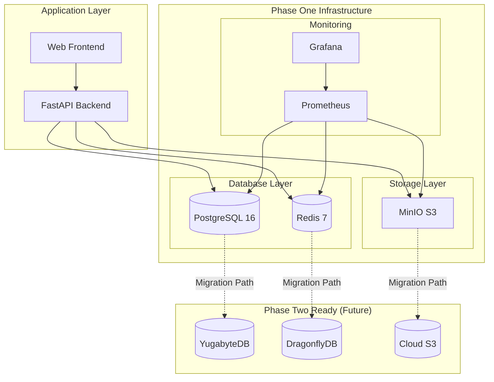

# Schlep Engine Phase One: Database & Cache Infrastructure

## 🚀 Quick Start

This is the complete Phase One database and cache infrastructure for Schlep Engine, designed for **1,000+ concurrent users** with a **<$300/month** budget and a **clear migration path to YugabyteDB + DragonflyDB**.

### Prerequisites

- Docker & Docker Compose
- Python 3.11+
- 4GB+ RAM available
- 20GB+ disk space

### Launch the Stack

```bash
# Clone and navigate to the phase-one directory
cd database/phase-one

# Copy environment configuration
cp .env.example .env

# Create data directories
mkdir -p data/{postgres,redis,minio,prometheus,grafana,backups}

# Launch all services
docker-compose -f docker-compose.phase-one.yml up -d

# Initialize database schema
python scripts/database.py migrate

# Verify everything is running
python scripts/database.py health
```

### Access Points

| Service | URL | Credentials |
|---------|-----|-------------|
| **Grafana Dashboard** | http://localhost:3000 | admin / schlep_grafana_dev_2024 |
| **MinIO Console** | http://localhost:9001 | schlep_admin / schlep_minio_dev_password_2024 |
| **Prometheus** | http://localhost:9090 | No auth |
| **PostgreSQL** | localhost:5432 | schlep_user / schlep_postgres_dev_2024 |
| **Redis** | localhost:6379 | Password: schlep_redis_dev_2024 |

---

## 📊 What's Included

### Core Infrastructure
- **PostgreSQL 16**: Primary database with YugabyteDB-compatible schema
- **Redis 7**: Cache and session store with DragonflyDB-compatible configuration
- **MinIO**: S3-compatible object storage for metadata and logs
- **Prometheus + Grafana**: Comprehensive monitoring and alerting
- **Nginx**: Reverse proxy and load balancer

### Migration Readiness
- **Zero-downtime migration strategy** to YugabyteDB + DragonflyDB
- **Dual-write compatibility** patterns
- **Performance benchmarking** tools
- **Data validation** utilities

### Cost Optimization
- **Resource limits** tuned for <$300/month
- **Monitoring** for cost efficiency
- **Auto-scaling** preparation
- **Performance per dollar** optimization

---

## 🏗️ Architecture Overview



---

## 🔧 Configuration

### Environment Variables

Key settings in `.env`:

```bash
# Database Configuration
POSTGRES_DB=schlep_engine
POSTGRES_USER=schlep_user
POSTGRES_PASSWORD=schlep_postgres_dev_2024

# Performance Tuning
POSTGRES_SHARED_BUFFERS=512MB
POSTGRES_EFFECTIVE_CACHE_SIZE=2GB
POSTGRES_MAX_CONNECTIONS=200

# Redis Configuration
REDIS_PASSWORD=schlep_redis_dev_2024

# Resource Limits (Cost Optimization)
POSTGRES_MEMORY_LIMIT=2G
REDIS_MEMORY_LIMIT=1G
MINIO_MEMORY_LIMIT=1G
```

### Performance Targets

| Metric | Phase One Target | Phase Two Target |
|--------|------------------|------------------|
| **Concurrent Users** | 1,000+ | 10,000+ |
| **Response Time** | <100ms (p95) | <50ms (p95) |
| **Throughput** | 1,000+ RPS | 10,000+ RPS |
| **Cache Hit Ratio** | >95% | >98% |
| **Monthly Cost** | <$300 | $800-1,200 |

---

## 🔍 Monitoring & Observability

### Pre-configured Dashboards

1. **Database Overview** - PostgreSQL performance metrics
2. **Cache Performance** - Redis operations and hit ratios
3. **System Resources** - CPU, memory, disk usage
4. **Cost Tracking** - Resource utilization and cost efficiency

### Alert Rules

- Database connection usage >80%
- Query response time >100ms
- Cache hit ratio <95%
- System resource usage >85%
- Service health checks failing

### Key Metrics

```bash
# Check database performance
curl "http://localhost:9090/api/v1/query?query=schlep:postgres_cache_hit_ratio"

# Check cache performance
curl "http://localhost:9090/api/v1/query?query=schlep:redis_memory_usage_ratio"

# Check system health
python scripts/database.py health
```

---

## 🧪 Performance Testing

### Load Testing Scripts

```bash
# Database load test
python scripts/database_load_test.py

# Cache performance test
python scripts/cache_load_test.py

# End-to-end API test
artillery run load-tests/api-load-test.yml
```

### Benchmarking

Expected performance baselines:

- **PostgreSQL**: 1,000+ TPS, <50ms avg response
- **Redis**: 15,000+ OPS, <1ms avg response
- **Overall System**: 1,000+ concurrent users, <100ms response

See `PERFORMANCE_TESTING_OPTIMIZATION_GUIDE.md` for detailed testing procedures.

---

## 📈 Scaling Strategy

### Current Capacity (Phase One)
- **1,000 concurrent users**
- **Single-instance deployment**
- **Cost-optimized configuration**

### Scaling Triggers
- CPU usage >70% sustained
- Memory usage >80% sustained
- Response time >100ms p95
- Connection pool >80% utilized

### Scaling Options

1. **Vertical Scaling** (Within Phase One)
   - Increase PostgreSQL memory allocation
   - Add Redis memory
   - Optimize connection pools

2. **Horizontal Scaling** (Transition to Phase Two)
   - YugabyteDB distributed cluster
   - DragonflyDB multi-node setup
   - Cloud-native object storage

---

## 🔄 Migration to Phase Two

### Migration Timeline

- **Week 1-2**: Deploy YugabyteDB + DragonflyDB
- **Week 2-3**: Dual-write data migration
- **Week 3-4**: Validation and cutover

### Migration Strategy

1. **Zero-downtime migration** using dual-write patterns
2. **Data validation** at every step
3. **Rollback capabilities** maintained
4. **Performance monitoring** throughout

### Key Benefits of Phase Two

- **10x scaling capacity** (10,000+ users)
- **Distributed architecture** for global deployment
- **Advanced features** (multi-region, auto-scaling)
- **Enterprise-grade reliability**

See `PHASE_TWO_MIGRATION_STRATEGY.md` for complete migration documentation.

---

## 🛠️ Maintenance

### Regular Tasks

```bash
# Weekly database maintenance
docker exec schlep_postgres_phase_one vacuumdb -U schlep_user -d schlep_engine -z -v

# Monthly backup verification
python scripts/backup_verification.py

# Quarterly performance review
python scripts/performance_analysis.py
```

### Backup Strategy

- **Automated daily backups** to MinIO
- **Point-in-time recovery** capability
- **Cross-validation** with production data
- **Retention**: 30 days local, 90 days remote

### Security Updates

- **Database patches**: Monthly maintenance window
- **Container updates**: Automated with testing
- **Configuration reviews**: Quarterly
- **Credential rotation**: Every 6 months

---

## 📚 Documentation

| Document | Description |
|----------|-------------|
| `PHASE_TWO_MIGRATION_STRATEGY.md` | Complete migration guide to YugabyteDB + DragonflyDB |
| `PERFORMANCE_TESTING_OPTIMIZATION_GUIDE.md` | Performance testing, optimization, and benchmarking |
| `schemas/01_core_schema.sql` | PostgreSQL schema optimized for YugabyteDB migration |
| `monitoring/` | Prometheus, Grafana, and alerting configurations |
| `scripts/` | Database utilities, migration tools, and health checks |

---

## 🆘 Troubleshooting

### Common Issues

**Database connection issues:**
```bash
# Check PostgreSQL logs
docker logs schlep_postgres_phase_one

# Test connection
python scripts/database.py health
```

**Cache performance issues:**
```bash
# Check Redis memory usage
docker exec schlep_redis_phase_one redis-cli -a schlep_redis_dev_2024 info memory

# Monitor cache hit ratio
docker exec schlep_redis_phase_one redis-cli -a schlep_redis_dev_2024 info stats
```

**Storage issues:**
```bash
# Check MinIO status
curl http://localhost:9000/minio/health/live

# Monitor storage usage
docker exec schlep_minio_phase_one df -h /data
```

### Support

- **Documentation**: All guides in this directory
- **Monitoring**: Grafana dashboards for real-time insights
- **Health Checks**: `python scripts/database.py health`
- **Performance Testing**: Load testing scripts in `scripts/`

---

## ✅ Production Checklist

Before deploying to production:

- [ ] Update all default passwords
- [ ] Configure TLS/SSL certificates
- [ ] Set up automated backups
- [ ] Configure monitoring alerts
- [ ] Run full performance tests
- [ ] Test disaster recovery procedures
- [ ] Review security configurations
- [ ] Document operational procedures

---

**Ready to scale to 10,000+ users?** See `PHASE_TWO_MIGRATION_STRATEGY.md` for the complete YugabyteDB + DragonflyDB migration guide.