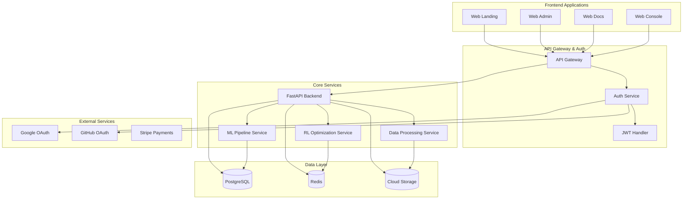
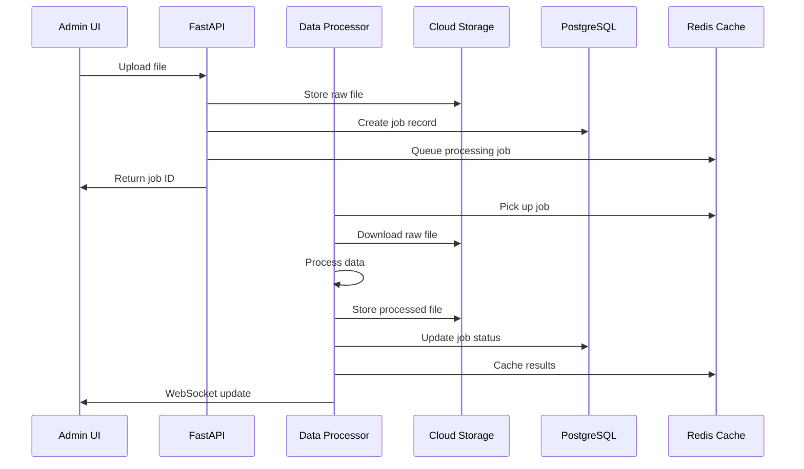
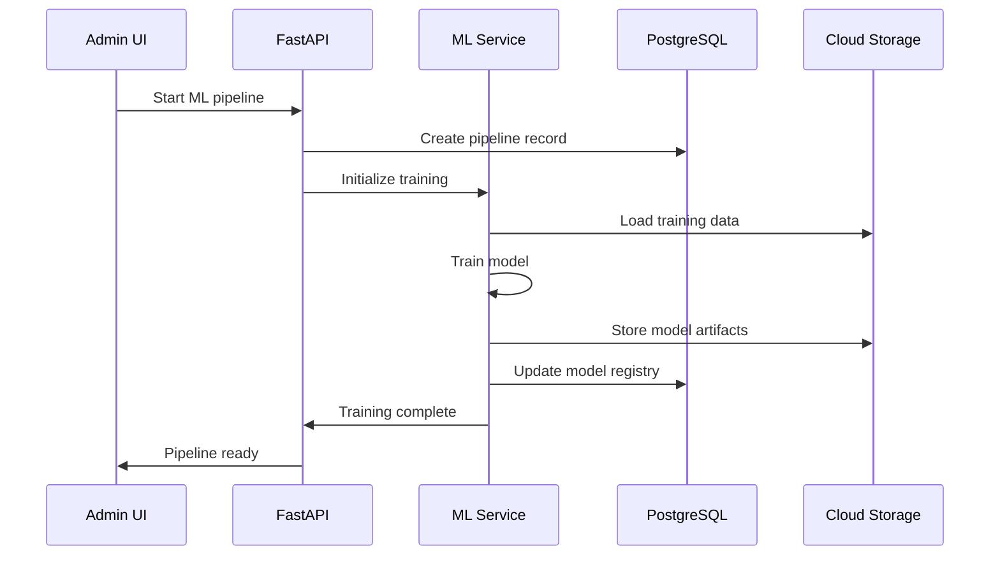
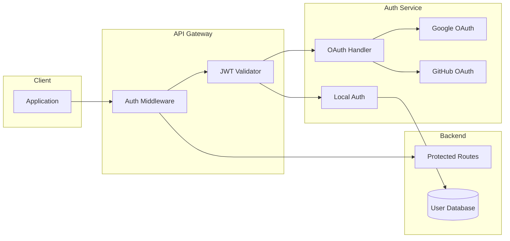
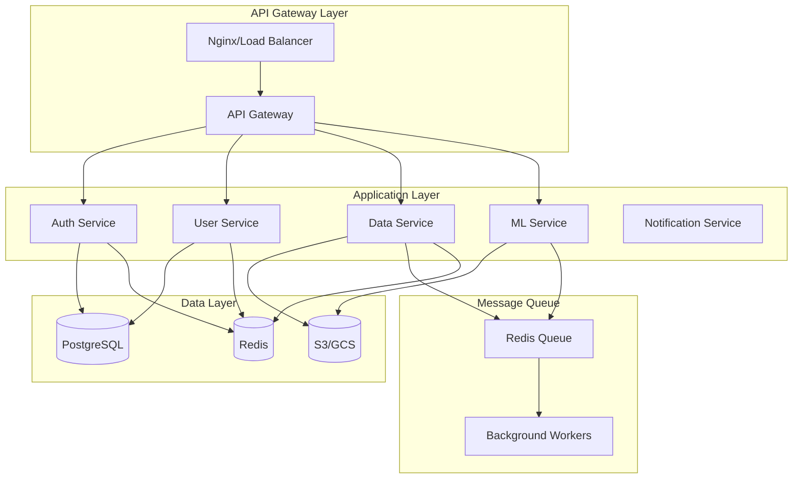
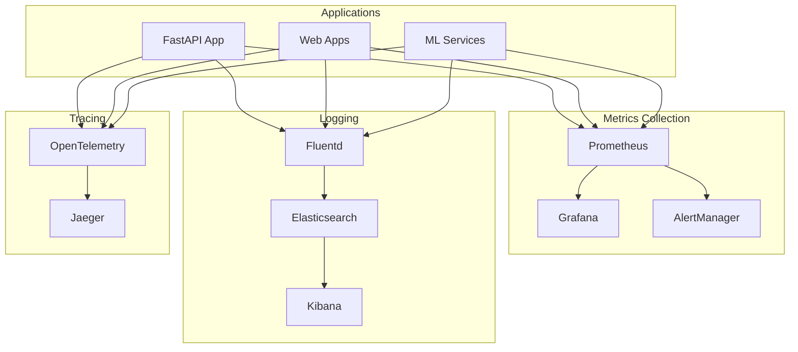

# 🏗️ Schlep-engine Architecture Guide

## 🎯 Overview

Schlep-engine is a comprehensive data processing and machine learning platform built on modern cloud-native architecture principles. This guide provides detailed information about the system architecture, components, and design decisions.

---

## 🏛️ High-Level Architecture



---

## 🏗️ System Components

### Frontend Applications

#### Web Landing (`/apps/web-landing`)
- **Purpose**: Marketing website and public documentation
- **Technology**: Next.js 14, TypeScript, Tailwind CSS
- **Port**: 3001 (development)
- **Features**: Landing pages, pricing, public documentation

#### Web Admin (`/apps/web-admin`)
- **Purpose**: Administrative dashboard for data management
- **Technology**: Next.js 14, TypeScript, Tailwind CSS, Radix UI
- **Port**: 3000 (development)
- **Features**: Data upload, ML pipeline management, user management

#### Web Docs (`/apps/web-docs`)
- **Purpose**: Interactive API documentation
- **Technology**: Next.js 14, MDX, TypeScript
- **Port**: 3002 (development)
- **Features**: API reference, tutorials, guides

#### Web Console (`/apps/web-console`)
- **Purpose**: Developer console and API testing interface
- **Technology**: Next.js 14, TypeScript, Monaco Editor
- **Features**: API playground, code generation, testing tools

### Backend Services

#### FastAPI Backend (`/apps/api`)
- **Purpose**: Core API service handling all business logic
- **Technology**: FastAPI, Python 3.11+, SQLAlchemy, Alembic
- **Port**: 8000
- **Features**:
  - RESTful API endpoints
  - Authentication and authorization
  - Data processing coordination
  - ML pipeline orchestration
  - WebSocket real-time communication

#### ML Pipeline Service
- **Purpose**: Machine learning model training and inference
- **Technology**: TensorFlow, PyTorch, Scikit-learn, MLflow
- **Features**:
  - Model training automation
  - Hyperparameter optimization
  - Model versioning and deployment
  - Performance monitoring

#### Data Processing Service
- **Purpose**: High-performance data transformation and cleaning
- **Technology**: Pandas, Dask, Apache Arrow
- **Features**:
  - Multi-format data ingestion
  - Streaming data processing
  - Data quality assessment
  - ETL pipeline orchestration

#### RL Optimization Service
- **Purpose**: Reinforcement learning for system optimization
- **Technology**: Stable-Baselines3, OpenAI Gym, Ray
- **Features**:
  - Hyperparameter optimization
  - Resource allocation optimization
  - Adaptive system tuning

### Data Layer

#### PostgreSQL Database
- **Purpose**: Primary data storage for structured data
- **Version**: PostgreSQL 15+
- **Features**:
  - User accounts and authentication
  - Data processing job metadata
  - ML model information
  - System configuration

**Schema Overview**:
```sql
-- Core tables
users                 -- User accounts and profiles
auth_providers        -- OAuth provider information
data_processing_jobs  -- Data processing job metadata
ml_models            -- Machine learning model registry
api_keys             -- API key management
audit_logs           -- System audit trail
```

#### Redis Cache
- **Purpose**: High-performance caching and session storage
- **Version**: Redis 7+
- **Features**:
  - Session management
  - API rate limiting
  - Real-time data caching
  - Background job queues

#### Cloud Storage
- **Purpose**: File storage for datasets and model artifacts
- **Providers**: Google Cloud Storage, Amazon S3
- **Features**:
  - Raw data storage
  - Processed dataset storage
  - ML model artifacts
  - System backups

---

## 🔄 Data Flow Architecture

### Data Processing Pipeline



### ML Pipeline Flow



---

## 🔐 Security Architecture

### Authentication Flow



### Security Layers

1. **Transport Security**
   - TLS 1.3 for all communications
   - HSTS headers
   - Certificate pinning

2. **Authentication**
   - JWT tokens with RS256 signing
   - OAuth 2.0 with PKCE
   - API key authentication
   - Multi-factor authentication (2FA)

3. **Authorization**
   - Role-based access control (RBAC)
   - Resource-level permissions
   - API rate limiting
   - Request validation

4. **Data Protection**
   - Encryption at rest (AES-256)
   - Encryption in transit (TLS 1.3)
   - PII data anonymization
   - Secure data deletion

---

## 🏛️ Microservices Architecture

### Service Communication



### Service Responsibilities

#### Auth Service
- User registration and login
- OAuth provider integration
- JWT token management
- Session handling
- Password reset functionality

#### User Service
- User profile management
- Organization management
- Role and permission management
- User preferences

#### Data Service
- File upload and validation
- Data processing coordination
- Quality assessment
- Format conversion
- ETL pipeline management

#### ML Service
- Model training orchestration
- Hyperparameter optimization
- Model deployment
- Inference serving
- Performance monitoring

#### Notification Service
- Email notifications
- Webhook delivery
- Real-time updates via WebSocket
- Push notifications

---

## 📊 Database Architecture

### PostgreSQL Schema Design

```sql
-- User Management
CREATE TABLE users (
    id UUID PRIMARY KEY DEFAULT gen_random_uuid(),
    email VARCHAR(255) UNIQUE NOT NULL,
    password_hash VARCHAR(255),
    full_name VARCHAR(255),
    is_active BOOLEAN DEFAULT true,
    is_verified BOOLEAN DEFAULT false,
    created_at TIMESTAMP WITH TIME ZONE DEFAULT NOW(),
    updated_at TIMESTAMP WITH TIME ZONE DEFAULT NOW()
);

-- OAuth Providers
CREATE TABLE oauth_accounts (
    id UUID PRIMARY KEY DEFAULT gen_random_uuid(),
    user_id UUID REFERENCES users(id) ON DELETE CASCADE,
    provider VARCHAR(50) NOT NULL,
    provider_account_id VARCHAR(255) NOT NULL,
    access_token TEXT,
    refresh_token TEXT,
    expires_at TIMESTAMP WITH TIME ZONE,
    created_at TIMESTAMP WITH TIME ZONE DEFAULT NOW(),
    UNIQUE(provider, provider_account_id)
);

-- Data Processing
CREATE TABLE data_processing_jobs (
    id UUID PRIMARY KEY DEFAULT gen_random_uuid(),
    user_id UUID REFERENCES users(id),
    filename VARCHAR(255) NOT NULL,
    file_size BIGINT,
    processing_mode VARCHAR(50),
    status VARCHAR(50) DEFAULT 'pending',
    progress INTEGER DEFAULT 0,
    error_message TEXT,
    result_url TEXT,
    created_at TIMESTAMP WITH TIME ZONE DEFAULT NOW(),
    completed_at TIMESTAMP WITH TIME ZONE
);

-- ML Models
CREATE TABLE ml_models (
    id UUID PRIMARY KEY DEFAULT gen_random_uuid(),
    user_id UUID REFERENCES users(id),
    name VARCHAR(255) NOT NULL,
    model_type VARCHAR(100),
    version VARCHAR(50),
    status VARCHAR(50),
    metrics JSONB,
    artifacts_url TEXT,
    created_at TIMESTAMP WITH TIME ZONE DEFAULT NOW()
);
```

### Redis Data Structures

```redis
# Session Management
SESSION:{session_id} -> {user_data}
TTL: 30 minutes

# Rate Limiting
RATE_LIMIT:{user_id}:{endpoint} -> {request_count}
TTL: 1 hour

# Job Queues
QUEUE:data_processing -> [job_ids]
QUEUE:ml_training -> [job_ids]

# Cache
CACHE:user:{user_id} -> {user_profile}
CACHE:model:{model_id} -> {model_metadata}
TTL: 1 hour
```

---

## 🚀 Deployment Architecture

### Development Environment

```yaml
# docker-compose.yml
version: '3.8'
services:
  postgres:
    image: postgres:15
    environment:
      POSTGRES_DB: schlep_engine
      POSTGRES_USER: dev_user
      POSTGRES_PASSWORD: dev_password

  redis:
    image: redis:7-alpine

  api:
    build: ./apps/api
    ports:
      - "8000:8000"
    depends_on:
      - postgres
      - redis

  admin:
    build: ./apps/web-admin
    ports:
      - "3000:3000"
```

### Production Kubernetes Deployment

```yaml
# k8s/namespace.yaml
apiVersion: v1
kind: Namespace
metadata:
  name: schlep-engine

---
# k8s/deployment.yaml
apiVersion: apps/v1
kind: Deployment
metadata:
  name: schlep-engine-api
  namespace: schlep-engine
spec:
  replicas: 3
  selector:
    matchLabels:
      app: schlep-engine-api
  template:
    metadata:
      labels:
        app: schlep-engine-api
    spec:
      containers:
      - name: api
        image: schlep-engine/api:latest
        ports:
        - containerPort: 8000
        env:
        - name: DATABASE_URL
          valueFrom:
            secretKeyRef:
              name: schlep-engine-secrets
              key: database-url
        - name: REDIS_URL
          valueFrom:
            secretKeyRef:
              name: schlep-engine-secrets
              key: redis-url
        resources:
          requests:
            memory: "512Mi"
            cpu: "500m"
          limits:
            memory: "2Gi"
            cpu: "1500m"
        livenessProbe:
          httpGet:
            path: /health
            port: 8000
          initialDelaySeconds: 30
          periodSeconds: 10
        readinessProbe:
          httpGet:
            path: /health/ready
            port: 8000
          initialDelaySeconds: 5
          periodSeconds: 5

---
# k8s/service.yaml
apiVersion: v1
kind: Service
metadata:
  name: schlep-engine-api-service
  namespace: schlep-engine
spec:
  selector:
    app: schlep-engine-api
  ports:
  - port: 80
    targetPort: 8000
  type: ClusterIP

---
# k8s/ingress.yaml
apiVersion: networking.k8s.io/v1
kind: Ingress
metadata:
  name: schlep-engine-ingress
  namespace: schlep-engine
  annotations:
    kubernetes.io/ingress.class: nginx
    cert-manager.io/cluster-issuer: letsencrypt-prod
spec:
  tls:
  - hosts:
    - api.schlep-engine.com
    secretName: schlep-engine-tls
  rules:
  - host: api.schlep-engine.com
    http:
      paths:
      - path: /
        pathType: Prefix
        backend:
          service:
            name: schlep-engine-api-service
            port:
              number: 80
```

---

## 📈 Monitoring & Observability

### Monitoring Stack



### Key Metrics

#### Application Metrics
- **Request Rate**: Requests per second
- **Response Time**: P50, P95, P99 latencies
- **Error Rate**: 4xx and 5xx error percentages
- **Active Users**: Concurrent user sessions

#### Infrastructure Metrics
- **CPU Usage**: Per container/pod
- **Memory Usage**: Current and peak usage
- **Disk I/O**: Read/write operations
- **Network I/O**: Inbound/outbound traffic

#### Business Metrics
- **Data Processing**: Jobs per hour, success rate
- **ML Pipeline**: Training time, model accuracy
- **User Engagement**: Feature usage, session duration
- **Revenue**: Usage-based billing metrics

---

## 🔧 Performance Optimization

### Database Optimization

#### Indexing Strategy
```sql
-- User lookups
CREATE INDEX idx_users_email ON users(email);
CREATE INDEX idx_users_active ON users(is_active) WHERE is_active = true;

-- Job queries
CREATE INDEX idx_jobs_user_status ON data_processing_jobs(user_id, status);
CREATE INDEX idx_jobs_created_at ON data_processing_jobs(created_at DESC);

-- OAuth lookups
CREATE INDEX idx_oauth_provider_account ON oauth_accounts(provider, provider_account_id);
```

#### Connection Pooling
```python
# Database configuration
SQLALCHEMY_ENGINE_OPTIONS = {
    "pool_size": 15,
    "max_overflow": 25,
    "pool_timeout": 45,
    "pool_recycle": 3600,
    "pool_pre_ping": True
}
```

### Caching Strategy

#### Redis Caching Layers
1. **L1 Cache**: Application-level caching (30 seconds)
2. **L2 Cache**: Redis caching (5 minutes)
3. **L3 Cache**: Database query results (1 hour)

```python
# Multi-level caching implementation
async def get_user_profile(user_id: str):
    # L1: Memory cache
    if user_id in memory_cache:
        return memory_cache[user_id]

    # L2: Redis cache
    cached = await redis.get(f"user:{user_id}")
    if cached:
        memory_cache[user_id] = cached
        return cached

    # L3: Database
    user = await db.get_user(user_id)
    await redis.setex(f"user:{user_id}", 3600, user)
    memory_cache[user_id] = user
    return user
```

### API Performance

#### Response Optimization
- **Compression**: Gzip compression for all responses
- **Pagination**: Limit response sizes with pagination
- **Field Selection**: Allow clients to specify required fields
- **Async Processing**: Non-blocking I/O operations

#### Rate Limiting
```python
# Tiered rate limiting
RATE_LIMITS = {
    "free": {"requests": 60, "window": 60},      # 60/minute
    "pro": {"requests": 300, "window": 60},      # 300/minute
    "enterprise": {"requests": 1000, "window": 60}  # 1000/minute
}
```

---

## 🛡️ Disaster Recovery

### Backup Strategy

#### Database Backups
- **Full Backup**: Daily at 2 AM UTC
- **Incremental Backup**: Every 6 hours
- **Point-in-Time Recovery**: 7-day retention
- **Cross-Region Replication**: Primary and secondary regions

#### File Storage Backups
- **Versioning**: Enabled on all storage buckets
- **Cross-Region Sync**: Automatic replication
- **Lifecycle Policies**: Automated archival to cold storage

### High Availability

#### Multi-Region Deployment
```yaml
# Primary Region (us-east-1)
- API Servers: 3 instances
- Database: Primary with read replicas
- Redis: Cluster mode
- Storage: Primary bucket

# Secondary Region (us-west-2)
- API Servers: 2 instances (standby)
- Database: Read replica
- Redis: Backup cluster
- Storage: Replicated bucket
```

#### Failover Procedures
1. **Automatic Detection**: Health checks every 30 seconds
2. **DNS Failover**: Route53 health-based routing
3. **Database Promotion**: Automatic replica promotion
4. **Service Recovery**: Kubernetes auto-restart policies

---

## 📋 Development Guidelines

### Code Organization

```
schlep-engine/
├── apps/                   # Application code
│   ├── api/               # FastAPI backend
│   ├── web-admin/         # Admin dashboard
│   ├── web-landing/       # Marketing site
│   └── web-docs/          # Documentation
├── packages/              # Shared packages
│   ├── ui/                # UI components
│   ├── types/             # TypeScript types
│   └── utils/             # Utility functions
├── scripts/               # Build and deployment scripts
├── docs/                  # Documentation
└── infrastructure/        # IaC and deployment configs
```

### API Design Principles

1. **RESTful Design**: Follow REST conventions
2. **Consistent Naming**: Use kebab-case for URLs
3. **Versioning**: API versioning with `/api/v1/` prefix
4. **Error Handling**: Consistent error response format
5. **Documentation**: OpenAPI/Swagger specifications

### Security Best Practices

1. **Input Validation**: Validate all user inputs
2. **Output Encoding**: Encode all outputs
3. **Authentication**: JWT with proper validation
4. **Authorization**: Role-based access control
5. **Audit Logging**: Log all sensitive operations

---

*Last Updated: January 2024*
*Architecture Guide Version: 1.0.0*