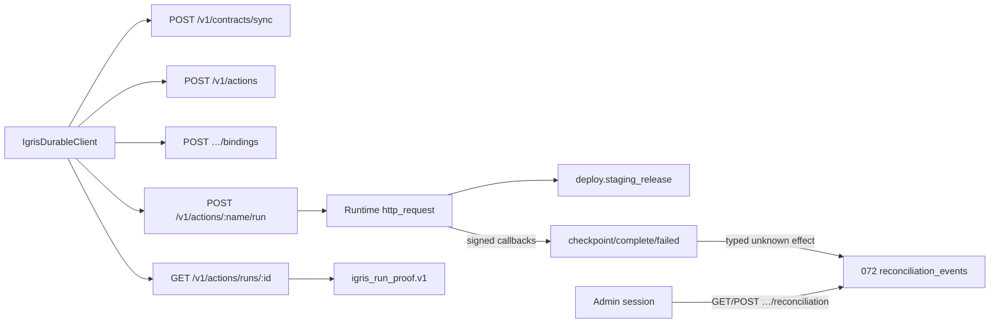

# Clock 3F — Integrated Product Reality Gate Report

**Date:** 2026-07-21  
**Branch:** `feature/clock-3f-product-validation`  
**Integration HEAD:** `1e2695e5c2e340671f35954c979d125d65d0ec75`  
**Base (Clock 3C ratified):** `0b4016354a8d1e301cfb2819bb716d85d15f2a3b`

## Executive summary

Clock 3D (`cb9f1543a`) and Clock 3E (`cdafee255`) merged cleanly with `--no-ff` and **zero conflicts**. Disposable migrations 070→071→072 applied successfully. A clean-room `igris-sdk` wheel install completed the `deploy.staging_release` journey through the public SDK (no raw Overture curl in the developer path). Scenarios A/B/C, operator reconciliation, and security negatives passed on disposable infrastructure. Full heavy Tier A passed on the exact integration tip. One P1 SDK defect was found and fixed: `DurableRunStatus.requires_reconciliation` ignored the top-level `reconciliation_required` flag when task status remained `failed`.

**Critical product friction remains:** contract-bound runs pause at `checkpoint_after_steps=1` after the HTTP effect; `DurableRun.wait()` alone times out unless infrastructure resumes via Runtime recovery. First durable completion is achievable in ~12s once the stack is up, but only because the validation harness performed the resume.

## Final verdict

**ENGINEERING_GREEN_PRODUCT_FRICTION_RED**

The integrated system is technically correct for the core path (binding, exactly-once adapter effect, recovery lineage, fail-closed uncertain effect, non-cryptographic operator reconciliation, truthful Run Proof claim boundaries). The clean-room product journey is still too infrastructure-shaped for validation users: checkpoint/resume is invisible in the durable quickstart, and completing a run requires operator/runtime recovery mechanics the SDK does not expose.

## Exact base and integration HEAD

| Item | SHA |
|------|-----|
| Clock 3C base | `0b4016354a8d1e301cfb2819bb716d85d15f2a3b` |
| Clock 3D candidate | `cb9f1543a93cc05f04817419248715deafa84754` |
| Clock 3E candidate | `cdafee255a66ea2efec56cf407fe298091d85e15` |
| Integration tip (post-fix) | `1e2695e5c2e340671f35954c979d125d65d0ec75` |

Ancestry verified: 3C base, 3D tip, and 3E tip are all ancestors of integration HEAD.

## Merge commits

1. `ea7d2d066` — Merge Clock 3D operator-reconciliation candidate (`0b4016354` + `cb9f1543a`)  
2. `38cc17d36` — Merge Clock 3E unified durable DX candidate (`ea7d2d066` + `cdafee255`)  
3. `1e2695e5c` — fix(clock-3f): staging adapter, product validation harness, and reconciliation DX  

No squash. No rebase. No force-push. No merge to main.

## Conflicts and resolutions

**None.** Both merges completed with the `ort` strategy and empty `git diff --check`.

## Core product surface inventory



- **SDK:** `sync_contract`, `create_action_target`, `ensure_binding`, `run`, `DurableRun.wait/status/proof`  
- **Operator reconciliation:** admin session only (no SDK reconcile method)  
- **Auth:** API key middleware on SDK routes; admin/session auth on reconciliation routes  
- **Excluded:** ROS2, speculative routing productization, LoRA, Evidence/ActionContract v2, dashboards  

## Disposable infrastructure configuration

| Component | Value |
|-----------|-------|
| PostgreSQL | `igris_clock3f_validation` @ localhost (disposable) |
| Overture | `:8081` binary `/tmp/clock3f-validation/bin/igris-overture` |
| Runtime 1/2 | `:8080` with distinct WAL paths |
| Adapter | `:18100` `deploy.staging_release` |
| Auth | tenant `igris_…` API key + Better Auth admin session (same tenant id) |
| Secrets | ephemeral only; no production credentials |

## Migration 071 and 072 results

Applied in order on disposable DB after 070:

- `070_contract_execution_bindings` — OK  
- `071_run_scoped_evidence_link_exclusivity` — OK  
- `072_operator_reconciliation_events` — OK  
- Migration guard: **OK** (067–072 remain manual-runbook-only)

## Clean-room installation

- Built wheel: `igris_sdk-0.1.0a2-py3-none-any.whl`  
- Fresh venv + `pip install` wheel only  
- `import igris` / `IgrisDurableClient` succeeded  
- Fresh `IGRIS_HOME`  

## Normal developer journey

Documented durable quickstart path followed (wrap → sync → target → exact binding → run → wait → proof). **No raw Overture curl** in the SDK journey. Infrastructure resume was required after checkpoint (harness-operated, not developer curl to task endpoints).

## Scenario A result

**PASS.** One staging deployment (`effect_journal_count=1`). Run completed after Runtime 1→2 resume. Idempotent SDK replay returned the same `run_id`. Runtime receipt and Action Protocol Evidence present as separate claims. Time to completed durable run: **12 seconds** (stack already up).

## Scenario B result

**PASS** (recovery lineage from Scenario A resume). Recovery events: `runtime_failed` → `handoff_allowed` → `redispatched`. Effect count remained **1**. No developer raw task endpoints.

Note: product architecture checkpoints **after** the HTTP effect; a pure “before-effect” hold injection is not how the bound graph currently resumes. Scenario B therefore validates two-Runtime recovery after post-effect checkpoint, which is the real recovery path.

## Scenario C result

**PASS.** `fail_after_effect` created exactly one deployment then typed unknown-effect. API key reconcile → **403**. Admin inspect + `confirmed_succeeded` with `deployment_id`. Proof: `operator_reconciliation.cryptographic_proof=false`, status `confirmed_succeeded`, effect count **1**. No automatic replay.

P1 found & fixed: SDK initially reported `status=failed` / `requires_reconciliation=false` despite server `reconciliation_required=true`.

## External effect counts

| Scenario | Deployments |
|----------|-------------|
| A | 1 |
| B (same run) | 1 (no duplicate) |
| C | 1 |

## Recovery lineage

Visible on `IgrisRunProof.recovery_lineage` (3 events for Scenario A/B).

## Operator reconciliation

Admin-session only; `cryptographic_proof=false`; secret-shaped reasons rejected; API keys cannot act as operator. Typed eligibility requires exact Runtime fields (`unknown_effect_state` + `idempotency_unresolved` + digest/host/status); free-form text cannot manufacture eligibility. Coordinator message explicitly: automatic replay is refused.

## Igris Run Proof claim boundaries

Present and truthful: `runtime_receipt`, `action_protocol_evidence`, `external_effect`, `linked_view`, `run_scoped_evidence`, `operator_reconciliation` (non-crypto). Claims remain separate (not unified).

## Security-negative results

Live checks passed: cross-tenant run rejected; API key not operator; missing idempotency rejected; wrong `contract_hash` rejected; secret-shaped recon reason rejected. Broader coverage via Go `./api` `./coordinator` `./middleware` tests and postgres suites (PASS), including `TestOperatorReconciliationPostgresLifecycleAndConcurrency` and `TestRunScopedEvidenceLinkPostgresEligibilityAndExclusivity`.

## SDK and CLI validation

- Full SDK suite: **289 passed** (pre-fix); durable+adapter tests **29 passed** post-fix  
- Ruff: clean on touched Python  
- Go vet: clean on affected packages  
- Route manifest tests: **OK**  
- Runtime `igris-tools` HTTP tests: **8 passed** (incl. typed unknown-effect)  
- Runtime callback signing tests (`igris-server` bin): **3 passed**  

## Clock 3B regression

**PASS** (standalone + inside heavy): contract-bound durable Action proof — endpoint invocations 1, consequential effects 1, HTTP /process calls 1, DB rows 1.

## Clock 3C regression

**PASS:** Run Proof claim-separation unit tests; run-scoped evidence link exclusivity postgres; contract binding postgres; frozen protocol identity unchanged.

## Full heavy Tier A result

**PASS** on tip `1e2695e5c` (`scripts/ci_proof_gate.sh heavy`):

- Fast backend packages OK  
- Cumulative / clean-host / same-host Action Task V1 recovery proofs OK  
- Action Task V1 proof OK  
- Clock 3B contract-bound proof OK  
- Core suite (task / unified / fallback / checkpoint) OK — containment available; **no mandatory proof skipped**  

Fast gate also passed independently earlier.

## Frozen manifest result

```
manifest_sha256=864e8043944191222af789b3d0dd3d947f03b1aadf52651bde97511d807776f4
```

Unchanged from the authoritative frozen value.

## Time to first durable run

- **With stack up:** ~12s to completed run (including mandatory resume)  
- **Fresh environment including service bring-up:** estimated 10–20+ minutes depending on Runtime build; **not** a 20-minute clean-room experience for an external engineer without a provisioned stack  
- **Within 20 minutes for clean-room engineer alone?** **No**, unless stack + resume automation is provided — they hit `checkpointed` and `DurableRun.wait()` times out.

## Developer concepts exposed

ActionContract, wrap_tool, IgrisDurableClient, action target, exact contract_hash binding, business idempotency key, DurableRun, Igris Run Proof, Runtime receipt, Action Protocol Evidence, **checkpoint/resume**, operator reconciliation (admin).

## Product-friction findings

| ID | Sev | Finding |
|----|-----|---------|
| checkpoint_resume_required | **P0** | Bound runs pause after HTTP effect; SDK wait times out without infra resume. Documented quickstart does not mention this. |
| reconciliation_flag_missed | **P1** (fixed) | SDK ignored top-level `reconciliation_required` when status=`failed`. |
| too_many_concepts | P2 | ~11 product concepts before first success. |
| admin_session_bootstrap | P2 | Operator recon requires Better Auth admin role aligned to tenant id (= user id). |

## Second-pass review findings and fixes

1. Confirmed no merge conflicts / history rewrite; ancestry of 3C/3D/3E tips intact.  
2. Traced A/B/C end-to-end on disposable stack; effect counts remain 1.  
3. Verified no auto-replay of uncertain effects (typed Runtime bridge + coordinator refuse message + adapter ledger).  
4. Verified operator claims remain non-cryptographic.  
5. Verified exact `contract_hash` + business idempotency still enforced.  
6. Verified `wrap_tool` remains Embedded-local (env alone does not remote).  
7. Fixed SDK reconciliation detection; added regression test.  
8. Added `deploy.staging_release` adapter with failure injection.  
9. No unrelated experimental surfaces entered the validated product path.  
10. Re-ran affected tests; full heavy Tier A green on exact tip.

## What is genuinely useful

- Exact contract_hash binding + business idempotency  
- Typed unknown-effect fail-closed path  
- Separate claim types in Igris Run Proof  
- Operator reconciliation as attestation, not proof  
- Explicit `IgrisDurableClient` (env alone never remotes `wrap_tool`)  

## What still feels overengineered

- Checkpoint-after-HTTP as the default bound graph forces recovery for “normal” completion  
- Tenant id = Better Auth user id coupling for admin ops  
- Many claim-boundary strings for a first durable deploy  

## Recommendation

**Narrow + simplify before external engineer validation:** make the happy path auto-continue past the post-HTTP checkpoint (or document and productize a first-class resume), and keep reconciliation/admin as an advanced surface. Do **not** merge to main yet.

## Exact next validation with an external engineer

1. Give them only: wheel, disposable endpoint, API key, adapter URL/token, durable quickstart.  
2. Ask them to complete one `deploy.staging_release` without reading this repo.  
3. Measure whether they get stuck at `checkpointed` (expected today).  
4. Separately, have an operator complete Scenario C recon with admin session.  
5. Independent review of branch `feature/clock-3f-product-validation` @ `1e2695e5c`.
