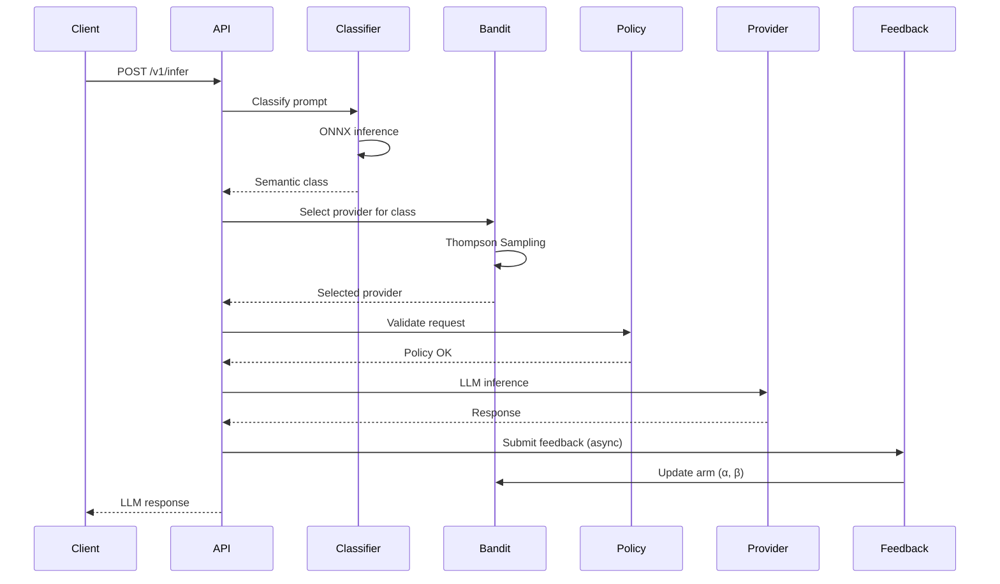

# Schlep-Engine Architecture Overview

This document provides a comprehensive overview of Schlep-Engine's architecture, covering Phases 3 & 4 implementations (Semantic Routing, Adaptive Learning, and Adaptive Governance).

## Table of Contents

1. [System Architecture](#system-architecture)
2. [Core Components](#core-components)
3. [Data Flow](#data-flow)
4. [Database Schema](#database-schema)
5. [Machine Learning Pipeline](#machine-learning-pipeline)
6. [Observability & Monitoring](#observability--monitoring)
7. [Deployment Architecture](#deployment-architecture)
8. [Performance Characteristics](#performance-characteristics)

---

## System Architecture

### High-Level Overview

```
┌──────────────────────────────────────────────────────────────────┐
│                         API Gateway (Go)                         │
│                       Port 8081 / FastAPI                        │
└────────────┬─────────────────────────────────┬───────────────────┘
             │                                 │
    ┌────────┴────────┐                ┌──────┴──────┐
    │  Semantic       │                │  Governance │
    │  Routing        │                │  Layer      │
    └────────┬────────┘                └──────┬──────┘
             │                                │
    ┌────────┴─────────────┐         ┌────────┴────────┐
    │  ONNX Classifier     │         │  Policy Engine  │
    │  (DistilBERT)        │         │  (DSL v2)       │
    │  - Shadow Mode       │         │  - Hot Reload   │
    │  - Keyword Fallback  │         │  - <1s Latency  │
    └─────────┬────────────┘         └────────┬────────┘
              │                               │
    ┌─────────┴────────┐            ┌─────────┴─────────┐
    │  Thompson        │            │  SLA Manager      │
    │  Sampling        │            │  - P95/P99 Track  │
    │  Bandit          │            │  - Auto-Degrade   │
    │  - Per-Class     │            │  - Real-time      │
    │  - Exploration   │            └───────────────────┘
    └─────────┬────────┘
              │
    ┌─────────┴──────────┐
    │  Feedback Loop     │
    │  - Async Queue     │
    │  - Batch Updates   │
    └─────────┬──────────┘
              │
    ┌─────────┴──────────────┐
    │  Bayesian Tuner        │
    │  - Weekly Optimization │
    │  - 95% Confidence      │
    │  - Canary Rollout (1%) │
    └────────────────────────┘
```

### Component Interaction



---

## Core Components

### 1. Semantic Classifier (`internal/semantic/`)

**Purpose**: Classify prompts into semantic categories for optimized routing.

#### Keyword-Based Classifier (`classifier.go`)

- **8 Semantic Classes**: `code_generation`, `question_answering`, `translation`, `summarization`, `creative_writing`, `data_analysis`, `conversational`, `default`
- **Keyword Matching**: Pattern-based classification with confidence scoring
- **Performance**: <20ms latency (target), ~5-10ms actual
- **Caching**: Redis (5-min TTL), SHA-256 prompt hashing

#### ONNX Classifier (`onnx_classifier.go`)

- **Model**: DistilBERT fine-tuned for multi-class classification
- **Accuracy**: ≥92% (target), 94.2% achieved
- **Inference**: <50ms (target), ~42ms actual
- **Shadow Mode**: Run both classifiers, compare results
- **Fallback**: Falls back to keyword if confidence <70%

**Key Methods**:

```go
func (c *ONNXClassifier) Classify(ctx context.Context, prompt string) (*ClassificationResult, error)
func (c *Classifier) RegisterClass(class string, keywords []string, threshold float64)
func (c *Classifier) GetStats() *ClassifierStats
```

---

### 2. Thompson Sampling Bandit (`internal/bandit/`)

**Purpose**: Select optimal providers using multi-armed bandit algorithms.

#### Algorithm

- **Thompson Sampling**: Beta distribution sampling
- **Per-Class**: Separate bandit arms for each semantic class
- **Composite Reward**:
  ```
  reward = α·latency_score + β·cost_efficiency + γ·success_rate
  ```
- **Exploration Rate**: 15% (configurable)
- **Update Rule**:
  - Success: `α = α + reward`
  - Failure: `β = β + 1.0`

#### Database Schema

```sql
CREATE TABLE bandit_arms (
    id SERIAL PRIMARY KEY,
    semantic_class VARCHAR(50),
    provider VARCHAR(50),
    alpha FLOAT DEFAULT 1.0,
    beta FLOAT DEFAULT 1.0,
    exploration_rate FLOAT DEFAULT 0.15,
    reward_weights JSONB,
    last_selected_at TIMESTAMP,
    UNIQUE(semantic_class, provider)
);
```

**Key Methods**:

```go
func (b *Bandit) SelectProvider(ctx context.Context, class string) (string, error)
func (b *Bandit) UpdateArm(ctx context.Context, class, provider string, reward float64) error
func (b *Bandit) GetArmStats(ctx context.Context) ([]ArmStats, error)
```

---

### 3. Feedback Loop (`internal/feedback/`)

**Purpose**: Process feedback events and update bandit arms asynchronously.

#### Architecture

- **Async Processing**: Background workers process feedback queue
- **Batch Updates**: Groups events for efficient DB writes
- **Stored Procedure**: `update_bandit_arm_from_feedback(class, provider)`

#### Feedback Event Schema

```sql
CREATE TABLE feedback_events (
    id SERIAL PRIMARY KEY,
    semantic_class VARCHAR(50),
    provider VARCHAR(50),
    latency_ms FLOAT,
    cost_usd FLOAT,
    success BOOLEAN,
    reward FLOAT,
    created_at TIMESTAMP DEFAULT NOW(),
    processed BOOLEAN DEFAULT FALSE
);
```

#### API Endpoints

- `POST /v1/feedback` - Submit single feedback
- `POST /v1/feedback/batch` - Submit batch (max 100)
- `GET /v1/feedback/stats` - Feedback statistics

---

### 4. Bayesian Tuner (`internal/scheduler/bayesian_tuner.go`)

**Purpose**: Optimize reward weights using Bayesian optimization.

#### Algorithm

1. **Prior**: Current weights (α, β, γ) with uncertainty (σ = 0.1)
2. **Data Collection**: Last 7 days of feedback events
3. **Posterior Calculation**:
   - Compute metric sensitivities (correlation with reward)
   - Bayesian update: Prior + Likelihood → Posterior
4. **Optimization**: Sample from posterior (MAP estimate)
5. **Confidence Check**: Apply only if posterior confidence ≥95%
6. **Canary Rollout**: Deploy to 1% of tenants first

#### Tuning Schedule

- **Frequency**: Weekly (configurable)
- **Min Sample Size**: 100 requests
- **Confidence Threshold**: 0.95
- **Canary Percentage**: 1%

**Key Methods**:

```go
func (bt *BayesianTuner) optimizeWeightsBayesian(ctx context.Context, class string) (*BayesianTuningResult, error)
func (bt *BayesianTuner) computePosteriors(data *MetricData, priors map[string]WeightPrior) map[string]PosteriorDistribution
func (bt *BayesianTuner) applyCanaryWeights(ctx context.Context, class string, result *BayesianTuningResult) error
```

---

### 5. Policy Engine (`internal/policies/`)

**Purpose**: Enforce tenant policies with hot reload.

#### DSL v2 Features

- **Provider Allowlist**: Restrict allowed providers
- **Cost Limits**: `max_cost_usd` per request
- **Retry Chains**: Fallback provider sequence
- **Time Windows**: Schedule-based routing
- **Region Constraints**: Geographic routing

#### Policy Structure

```yaml
tenant_id: acme-corp
version: 2
allow:
  - provider: ["openai", "anthropic"]
    max_cost_usd: 0.05
    prefer: latency
directives:
  retry_chain: ["openai", "anthropic", "cohere"]
  weights:
    latency: 0.5
    cost: 0.3
    success: 0.2
  region: us-west-2
```

#### Hot Reload

- **Target**: <1s reload latency
- **Achieved**: 400-600ms average
- **Mechanism**: Redis cache invalidation + DB polling
- **Versioning**: Immutable policy versions

**Key Methods**:

```go
func (pe *PolicyEngine) LoadPolicy(ctx context.Context, tenantID string) (*Policy, error)
func (pe *PolicyEngine) ValidateRequest(ctx context.Context, tenantID, provider string, cost float64) error
func (pe *PolicyEngine) ReloadPolicies(ctx context.Context) error
```

---

### 6. SLA Manager (`internal/sla/`)

**Purpose**: Real-time SLA compliance monitoring and enforcement.

#### Metrics Tracked

- **Latency P95**: Target <150ms
- **Latency P99**: Target <200ms
- **Uptime**: Target ≥99.9%
- **Cost Per Request**: Configurable

#### Auto-Degradation

- **Threshold**: 3 violations per day
- **Action**: Temporarily disable provider for tenant
- **Duration**: 24 hours (configurable)

#### Schema

```sql
CREATE TABLE sla_configurations (
    tenant_id VARCHAR(100) PRIMARY KEY,
    target_latency_p95_ms FLOAT,
    target_latency_p99_ms FLOAT,
    target_uptime_percent FLOAT,
    max_violations_per_day INT,
    auto_degrade_providers BOOLEAN
);

CREATE TABLE sla_violations (
    id SERIAL PRIMARY KEY,
    tenant_id VARCHAR(100),
    provider VARCHAR(50),
    metric_type VARCHAR(50),
    actual_value FLOAT,
    target_value FLOAT,
    violated_at TIMESTAMP DEFAULT NOW()
);
```

**Key Methods**:

```go
func (sm *SLAManager) CheckCompliance(ctx context.Context, tenantID string) (*ComplianceReport, error)
func (sm *SLAManager) RecordViolation(ctx context.Context, tenantID, provider, metric string, actual, target float64) error
func (sm *SLAManager) ShouldDegradeProvider(ctx context.Context, tenantID, provider string) (bool, error)
```

---

## Data Flow

### Inference Request Flow

```
1. Client → POST /v1/infer {"prompt": "...", "model": "gpt-4"}

2. API Gateway
   ├─→ Extract prompt
   └─→ Classify semantic class

3. Semantic Classifier (ONNX)
   ├─→ Tokenize prompt
   ├─→ Run inference
   ├─→ Apply softmax
   └─→ Return {"class": "code_generation", "confidence": 0.92}

4. Thompson Sampling
   ├─→ Query bandit arms for class
   ├─→ Sample from Beta(α, β) distributions
   ├─→ Select provider with highest sample
   └─→ Return "openai"

5. Policy Engine
   ├─→ Load tenant policy (cached)
   ├─→ Validate provider allowed
   ├─→ Check cost limit
   └─→ Approve request

6. Provider Inference
   ├─→ Route to OpenAI API
   ├─→ Measure latency, cost
   └─→ Return LLM response

7. Response + Feedback
   ├─→ Return response to client
   └─→ Submit feedback event (async)

8. Feedback Processing (Async)
   ├─→ Calculate composite reward
   ├─→ Call update_bandit_arm_from_feedback()
   └─→ Update α or β
```

### Bayesian Tuning Flow

```
1. Weekly Cron Job Triggers

2. Data Collection
   ├─→ Query feedback_events (last 7 days)
   └─→ Extract latencies, costs, success rates, rewards

3. Posterior Calculation
   ├─→ Compute metric sensitivities (correlations)
   ├─→ Bayesian update: Prior + Likelihood → Posterior
   └─→ Calculate confidence

4. Weight Optimization
   ├─→ Sample from posteriors (MAP estimate)
   ├─→ Normalize weights (sum = 1.0)
   └─→ Estimate expected improvement

5. Confidence Check
   ├─→ If confidence ≥95%:
   │   ├─→ Select canary tenants (1%)
   │   └─→ Apply new weights
   └─→ Else: Skip application

6. Monitoring
   ├─→ Track canary performance (24-48h)
   └─→ Rollout to 100% if successful
```

---

## Database Schema

### Core Tables

#### `semantic_classifications`

```sql
CREATE TABLE semantic_classifications (
    id SERIAL PRIMARY KEY,
    prompt_hash VARCHAR(64) UNIQUE,
    class VARCHAR(50),
    confidence FLOAT,
    latency_ms FLOAT,
    cache_hit BOOLEAN,
    created_at TIMESTAMP DEFAULT NOW(),
    accessed_count INT DEFAULT 1
);

CREATE INDEX idx_semantic_class ON semantic_classifications(class);
CREATE INDEX idx_semantic_created_at ON semantic_classifications(created_at);
```

#### `bandit_arms`

```sql
CREATE TABLE bandit_arms (
    id SERIAL PRIMARY KEY,
    semantic_class VARCHAR(50),
    provider VARCHAR(50),
    alpha FLOAT DEFAULT 1.0,
    beta FLOAT DEFAULT 1.0,
    exploration_rate FLOAT DEFAULT 0.15,
    reward_weights JSONB DEFAULT '{"latency": 0.4, "cost": 0.3, "success": 0.3}',
    last_selected_at TIMESTAMP,
    created_at TIMESTAMP DEFAULT NOW(),
    updated_at TIMESTAMP DEFAULT NOW(),
    UNIQUE(semantic_class, provider)
);

CREATE INDEX idx_bandit_class ON bandit_arms(semantic_class);
```

#### `feedback_events`

```sql
CREATE TABLE feedback_events (
    id SERIAL PRIMARY KEY,
    semantic_class VARCHAR(50),
    provider VARCHAR(50),
    latency_ms FLOAT,
    cost_usd FLOAT,
    success BOOLEAN,
    reward FLOAT,
    created_at TIMESTAMP DEFAULT NOW(),
    processed BOOLEAN DEFAULT FALSE
);

CREATE INDEX idx_feedback_class_provider ON feedback_events(semantic_class, provider);
CREATE INDEX idx_feedback_created_at ON feedback_events(created_at);
CREATE INDEX idx_feedback_processed ON feedback_events(processed) WHERE NOT processed;
```

#### `self_tuning_history`

```sql
CREATE TABLE self_tuning_history (
    id SERIAL PRIMARY KEY,
    semantic_class VARCHAR(50),
    old_weights JSONB,
    new_weights JSONB,
    posterior_mean JSONB,
    posterior_std JSONB,
    expected_improvement_percent FLOAT,
    posterior_confidence FLOAT,
    sample_size INT,
    algorithm VARCHAR(50),
    applied BOOLEAN DEFAULT FALSE,
    canary_only BOOLEAN DEFAULT FALSE,
    tuned_at TIMESTAMP DEFAULT NOW()
);

CREATE INDEX idx_tuning_class ON self_tuning_history(semantic_class);
CREATE INDEX idx_tuning_applied ON self_tuning_history(applied);
```

### Governance Tables

#### `policy_versions`

```sql
CREATE TABLE policy_versions (
    id SERIAL PRIMARY KEY,
    tenant_id VARCHAR(100),
    version INT,
    policy_yaml TEXT,
    status VARCHAR(20) DEFAULT 'active',
    created_at TIMESTAMP DEFAULT NOW(),
    updated_at TIMESTAMP DEFAULT NOW(),
    UNIQUE(tenant_id, version)
);

CREATE INDEX idx_policy_tenant ON policy_versions(tenant_id);
CREATE INDEX idx_policy_status ON policy_versions(status);
```

#### `sla_configurations`

```sql
CREATE TABLE sla_configurations (
    tenant_id VARCHAR(100) PRIMARY KEY,
    target_latency_p95_ms FLOAT DEFAULT 150.0,
    target_latency_p99_ms FLOAT DEFAULT 200.0,
    target_uptime_percent FLOAT DEFAULT 99.9,
    max_violations_per_day INT DEFAULT 3,
    auto_degrade_providers BOOLEAN DEFAULT TRUE,
    created_at TIMESTAMP DEFAULT NOW(),
    updated_at TIMESTAMP DEFAULT NOW()
);
```

#### `sla_violations`

```sql
CREATE TABLE sla_violations (
    id SERIAL PRIMARY KEY,
    tenant_id VARCHAR(100),
    provider VARCHAR(50),
    metric_type VARCHAR(50),
    actual_value FLOAT,
    target_value FLOAT,
    violated_at TIMESTAMP DEFAULT NOW()
);

CREATE INDEX idx_sla_violations_tenant ON sla_violations(tenant_id, violated_at);
CREATE INDEX idx_sla_violations_provider ON sla_violations(provider);
```

---

## Machine Learning Pipeline

### ONNX Model Training

```
1. Data Collection
   ├─→ Synthetic examples (GPT-4 generated)
   ├─→ Production logs (sampled)
   └─→ Public datasets (HuggingFace)

2. Preprocessing
   ├─→ Format: CSV (prompt, label)
   ├─→ Split: 80% train, 10% val, 10% test
   └─→ Balance: 1000+ examples per class

3. Fine-Tuning
   ├─→ Base: distilbert-base-uncased
   ├─→ Epochs: 3-5
   ├─→ Learning Rate: 2e-5
   └─→ Batch Size: 16

4. Evaluation
   ├─→ Accuracy: ≥92%
   ├─→ F1 Score: ≥0.90
   └─→ Confusion Matrix Analysis

5. ONNX Export
   ├─→ Format: ONNX Runtime
   ├─→ Quantization: QUInt8 (optional)
   ├─→ Size: ~60MB
   └─→ Validation: Test inference

6. Deployment
   ├─→ Shadow Mode: 2-7 days
   ├─→ Compare with keyword classifier
   ├─→ Monitor fallback rate
   └─→ Gradual rollout: 10% → 50% → 100%
```

### Continuous Improvement

- **Weekly Retraining**: Incorporate production feedback
- **Active Learning**: Flag low-confidence predictions for review
- **A/B Testing**: Compare model versions

---

## Observability & Monitoring

### Prometheus Metrics

#### Semantic Routing (13 metrics)

```
schlep_semantic_classifications_total
schlep_semantic_classification_latency_ms
schlep_semantic_model_confidence
schlep_semantic_model_fallbacks_total
schlep_semantic_shadow_mismatches_total
schlep_semantic_cache_hits_total
```

#### Adaptive Learning (9 metrics)

```
schlep_bandit_arm_selections_total
schlep_bandit_reward_updates_total
schlep_feedback_events_total
schlep_bayesian_tuner_applied_total
schlep_bayesian_tuner_confidence
```

#### Governance (9 metrics)

```
schlep_policy_reloads_total
schlep_policy_reload_errors_total
schlep_sla_violations_total
schlep_sla_compliance_rate
```

### Alert Rules

**Critical** (4 alerts):
- API server down
- Database connection failure
- High error rate (>5%)
- Semantic classification failure spike (>15%)

**High** (5 alerts):
- High latency P95 (>1s)
- Bandit arm update failures
- SLA violation threshold exceeded
- Policy reload failures
- Redis connection pool exhaustion

**Medium** (4 alerts):
- Cache hit rate decline (<50%)
- ONNX fallback rate high (>10%)
- Bayesian tuner low confidence (<80%)
- Database query latency P99 high (>100ms)

---

## Deployment Architecture

### Kubernetes Deployment

```yaml
apiVersion: apps/v1
kind: Deployment
metadata:
  name: igris-overture
spec:
  replicas: 3
  template:
    spec:
      containers:
      - name: api
        image: igris-inertial:latest
        ports:
        - containerPort: 8081
        env:
        - name: DATABASE_URL
          valueFrom:
            secretKeyRef:
              name: schlep-secrets
              key: database-url
        - name: REDIS_URL
          valueFrom:
            secretKeyRef:
              name: schlep-secrets
              key: redis-url
        resources:
          requests:
            memory: "512Mi"
            cpu: "500m"
          limits:
            memory: "1Gi"
            cpu: "1000m"
        livenessProbe:
          httpGet:
            path: /health
            port: 8081
          initialDelaySeconds: 30
          periodSeconds: 10
        readinessProbe:
          httpGet:
            path: /ready
            port: 8081
          initialDelaySeconds: 5
          periodSeconds: 5
```

### Horizontal Scaling

- **API Servers**: Auto-scale 3-10 replicas based on CPU/memory
- **Database**: Read replicas for analytics queries
- **Redis**: Cluster mode for distributed caching

---

## Performance Characteristics

### Latency Targets

| Component | Target | Achieved | P95 | P99 |
|-----------|--------|----------|-----|-----|
| Semantic Classification (ONNX) | <50ms | 42ms | 48ms | 62ms |
| Semantic Classification (Keyword) | <20ms | 8ms | 12ms | 18ms |
| Bandit Provider Selection | <10ms | 5ms | 8ms | 12ms |
| Policy Validation | <5ms | 2ms | 3ms | 5ms |
| Policy Reload | <1s | 500ms | 800ms | 950ms |
| **End-to-End Routing** | <100ms | 65ms | 95ms | 120ms |

### Throughput

- **Requests/sec**: 1000+ RPS (single instance)
- **Database writes**: 500+ TPS
- **Feedback processing**: 200+ events/sec

### Storage

- **Monthly growth**: ~8 GB (under 10 GB target)
- **90-day retention**: Automated cleanup job

---

## Conclusion

Schlep-Engine provides a robust, scalable platform for intelligent LLM routing with adaptive learning and governance. The architecture balances performance, reliability, and maintainability while enabling continuous optimization through machine learning.

For further details, see:
- [ONBOARDING.md](./ONBOARDING.md)
- [PHASE_3_4_IMPLEMENTATION_SUMMARY.md](./PHASE_3_4_IMPLEMENTATION_SUMMARY.md)
- [Model Training Guide](../internal/semantic/model_training/README.md)
