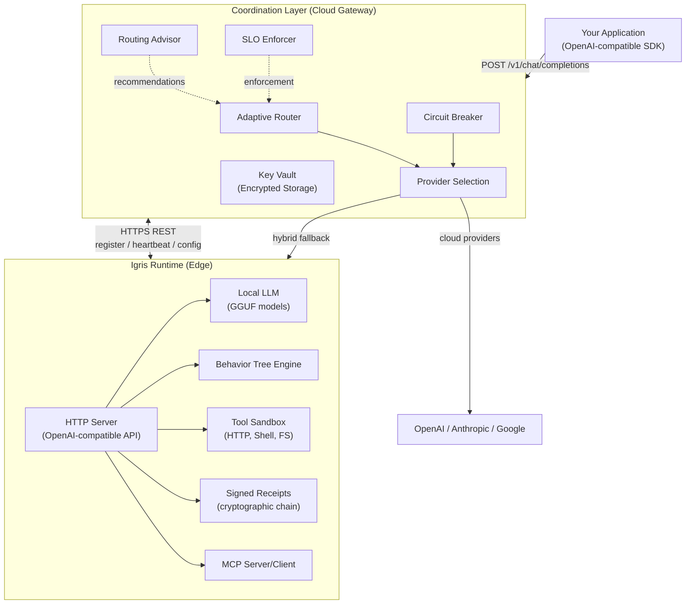

# Architecture

Igris is a governed execution system built from two production components: the **Coordination Layer** (cloud API gateway) and the **Runtime** (edge engine). Both share the same governance model, trust chain, and OpenAI-compatible API surface.

---

## System Overview

<Tabs items={['Operational view', 'Mermaid source']}>
  <Tab>
    <Callout title="How to read this system" type="info">
      Igris is one product with two execution surfaces. Applications usually call the hosted control
      plane first. That layer decides whether work stays on cloud providers or is handed off to a
      local runtime.
    </Callout>

    | Layer | Responsibility |
    |---|---|
    | **Application** | Calls the OpenAI-compatible API exposed by Igris |
    | **Coordination Layer** | Handles routing, provider policy, circuit breaking, SLO enforcement, billing, and fleet control |
    | **Cloud Providers** | Execute hosted inference when the policy chooses a cloud path |
    | **Runtime** | Executes local inference, tools, behavior trees, receipts, and MCP-aware work on edge or robotics hardware |

    The coordination layer and the runtime stay connected through registration, heartbeat, config
    distribution, and hybrid fallback paths. That gives you one operational contract even when work
    moves between cloud and local execution.
  </Tab>
  <Tab>

  </Tab>
</Tabs>

---

## Coordination Layer (Cloud Gateway)

The coordination layer runs as a managed cloud service or can be self-hosted in your infrastructure (Infinite tier). It serves as the central API gateway, routing engine, and control plane.

### Core Capabilities

| Capability | Purpose |
|---|---|
| **Adaptive Router** | Adaptive provider selection, speculative execution, council mode, cost-aware routing, quality scoring, stream merging |
| **Circuit Breaker** | Per-provider failure detection with open/closed/half-open states |
| **Routing Advisor** | Periodic analysis of routing performance with optimization proposals |
| **SLO Enforcer** | Automated monitoring and enforcement for latency, cost, and quality targets |
| **Key Vault** | Encrypted API key storage with rotation support |
| **Billing Integration** | Subscription management, trial handling, tier enforcement |
| **Provider Interface** | Pluggable provider implementations for OpenAI, Anthropic, Google, and OpenAI-compatible endpoints |

### Data Layer

- **Persistent storage** — Multi-tenant data including tenant configuration, API keys, runtime instances, execution records, and billing events
- **Distributed cache** — Rate limiting, billing state, provider statistics, and session management

### API Surface

The coordination layer exposes:
- **Inference API** — OpenAI-compatible `/v1/chat/completions` with automatic multi-provider routing
- **Management API** — Fleet, policies, receipts, vault keys, routing configuration
- **Webhooks** — Subscription events, alert notifications, human-in-the-loop escalations

---

## Igris Runtime (Edge Engine)

The Runtime is a single binary that provides a local OpenAI-compatible API with full governance. It runs on your infrastructure — servers, edge devices, or robotics hardware.

### Core Capabilities

| Capability | Purpose |
|---|---|
| **Local Inference** | GGUF model inference with GPU offloading (Metal/CUDA) |
| **Routing Engine** | Adaptive provider selection, speculative execution, council mode |
| **Behavior Trees** | Structured agent execution with live SSE streaming |
| **Tool Sandbox** | HTTP, shell, filesystem tools with resource limits and whitelists |
| **Agent Patterns** | Reflection, planning, tool-use, and swarm coordination |
| **Memory** | Vector store, KV cache, cross-instance context sharing |
| **Federated Learning** | Privacy-preserving model aggregation across fleet devices |
| **On-Device Training** | LoRA fine-tuning with encrypted adapter storage |
| **Human-in-the-Loop** | Approval gates with confidence thresholds |
| **Safety Containment** | Resource limits, capability enforcement, watchdog timers |
| **MCP Integration** | Model Context Protocol with peer discovery |
| **ROS2 Integration** | Native ROS2 node with topic/service/action support |
| **Multimodal** | Vision and audio input processing |

**Key capabilities:**
- Ed25519-signed, hash-chained execution receipts
- Cloud provider routing with automatic fallback to local GGUF models
- Behavior Tree execution with live SSE streaming
- Swarm coordination across multiple runtime instances
- Federated learning with privacy-preserving aggregation
- ROS2 topic/service integration for robotics

---

## Trust Chain

Every execution in Igris is traceable from API call to signed receipt:

<Steps>
  <Step>
    **Application Request.** The request starts with a unique request ID and tenant context.
  </Step>
  <Step>
    **Coordination Layer.** The router selects a provider path and applies SLO and circuit-breaker checks.
  </Step>
  <Step>
    **Execution.** The selected cloud provider or local runtime executes the request under the applicable capability and safety rules.
  </Step>
  <Step>
    **Signed Receipt.** Igris records the canonical envelope: inputs, outputs, timing, resource use, and any violations.
  </Step>
  <Step>
    **Audit Trail.** Receipts are hash-chained, queryable, exportable, and tamper-evident.
  </Step>
</Steps>

Each receipt links to the previous via hash chain. Signatures use device-bound keys that cannot be regenerated without the signing key.

[Execution Receipts →](/docs/execution-receipts) · [Governance →](/docs/governance)

---

## Deployment Topologies

**Cloud-only.** Application routes to the coordination layer, which routes to cloud providers. No Runtime deployed. Use for intelligent routing without on-premise infrastructure.

**Hybrid.** The coordination layer handles most requests via cloud providers. When providers fail or policy requires it, traffic routes to a registered Runtime instance. The Runtime registers automatically on startup and sends periodic heartbeats.

**Edge / offline.** The Runtime runs directly on device with local GGUF models. No coordination layer connection required. Full governance (bounded execution, signed receipts, tool sandbox) works offline.

**Fleet.** Multiple Runtime instances coordinated from the coordination layer. Used for robotics, edge deployments, and multi-site production. Config distribution, OTA updates, and health monitoring are managed centrally.

---

[Cloud Coordination →](/docs/cloud-coordination) · [Deployment →](/docs/deployment)
