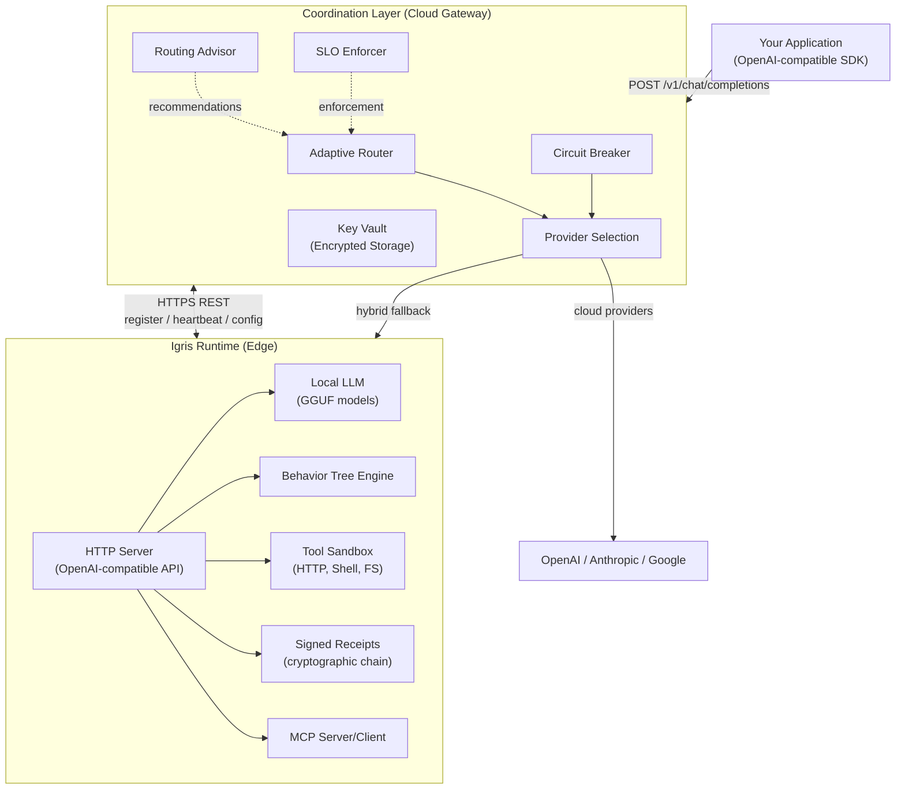

# Architecture

Igris is one execution system for AI tasks. The best way to read the architecture is not "which product do I buy?" but "how does a request move through Request -> Execute -> Verify?"

At a high level:

- **Request** enters through an Igris API surface.
- **Execute** happens on the configured hosted or runtime path, with policy, capability, and routing decisions applied along the way.
- **Verify** happens through execution metadata, signed records, and receipt-oriented audit material after the run.

The hosted control plane and the runtime are implementation components inside that unified model. They matter for deployment and operations, but they should not be your first mental model.

---

## System Overview

<Tabs items={['Operational view', 'Mermaid source']}>
  <Tab>
    <Callout title="How to read this system" type="info">
      Start from the execution flow, then map it to components. A request enters Igris, execution
      happens on the configured path, and verification data comes back with the result. Hosted and
      runtime surfaces are deployment choices, not separate product identities.
    </Callout>

    | Layer | Responsibility |
    |---|---|
    | **Application** | Sends requests through an Igris API surface |
    | **Execution Control** | Applies routing, policy, runtime selection, and failure-path handling |
    | **Hosted Providers** | Execute hosted model work when the configured path stays in cloud infrastructure |
    | **Runtime** | Executes governed local or hybrid work, returns execution artifacts, and emits signed receipt material |

    Registration, heartbeat, receipt sync, and task handoff connect the hosted and runtime layers
    when you run Igris in hybrid mode.
  </Tab>
  <Tab>

  </Tab>
</Tabs>

---

## Coordination Layer (Cloud Gateway)

The coordination layer is the hosted control plane. It accepts requests, applies routing and policy decisions, and coordinates runtimes when hybrid execution is enabled.

### Core Capabilities

| Capability | Purpose |
|---|---|
| **Routing and selection** | Chooses where work should run based on configured providers, runtime availability, and policy context |
| **Circuit Breaker** | Per-provider failure detection with open/closed/half-open states |
| **Policy and SLO controls** | Applies operational limits, health signals, and enforcement rules |
| **Key Vault** | Encrypted API key storage with rotation support |
| **Billing Integration** | Subscription management, trial handling, tier enforcement |
| **Provider Interface** | Connects to hosted providers and runtime-backed execution paths |

### Data Layer

- **Persistent storage** — Multi-tenant data including tenant configuration, API keys, runtime instances, execution records, and billing events
- **Distributed cache** — Rate limiting, billing state, provider statistics, and session management

### API Surface

The coordination layer exposes:
- **Inference API** — Request entry points such as `/v1/infer` and `/v1/chat/completions`
- **Management API** — Runtime lifecycle, policy, receipts, vault keys, and operator workflows
- **Webhooks** — Subscription events, alert notifications, human-in-the-loop escalations

---

## Igris Runtime (Edge Engine)

The Runtime is the execution engine for governed local or hybrid work. It runs on your infrastructure and can return signed execution artifacts as part of the run.

### Core Capabilities

| Capability | Purpose |
|---|---|
| **Task execution** | Runs governed task flows and returns execution-state artifacts |
| **Local inference** | Supports on-device model execution paths where configured |
| **Runtime routing** | Supports optional routing strategies inside the runtime execution stack |
| **Behavior Trees** | Structured agent execution with live SSE streaming |
| **Tool Sandbox** | HTTP, shell, filesystem tools with resource limits and whitelists |
| **Human-in-the-Loop** | Approval gates with confidence thresholds |
| **Safety Containment** | Resource limits, capability enforcement, watchdog timers |
| **MCP Integration** | Model Context Protocol with peer discovery |
| **ROS2 Integration** | Technical-preview robotics surface, not part of the default proof-backed path |
| **Multimodal** | Preview or stub-heavy surface, not part of the default proof-backed path |

**Key capabilities:**
- Ed25519-signed, hash-chained execution receipts
- Behavior Tree execution with live SSE streaming
- Capability-gated task execution and bounded runtime policies
- Local or hybrid execution paths that can feed back verification-ready records

Advanced capabilities such as local GGUF fallback, fleet failover, ROS2 execution, and multimodal flows should be treated according to their proof-status labels, not assumed from this overview alone.

---

## Trust Chain

Every execution in Igris is traceable from API call to signed receipt:

<Steps>
  <Step>
    **Application Request.** The request starts with a unique request ID and tenant context.
  </Step>
  <Step>
    **Coordination Layer.** The router selects a provider path and applies SLO and circuit-breaker checks.
  </Step>
  <Step>
    **Execution.** The selected cloud provider or local runtime executes the request under the applicable capability and safety rules.
  </Step>
  <Step>
    **Signed Receipt.** Igris records the canonical envelope: inputs, outputs, timing, resource use, and any violations.
  </Step>
  <Step>
    **Audit Trail.** Receipts are hash-chained, queryable, exportable, and tamper-evident.
  </Step>
</Steps>

Each receipt links to the previous via hash chain. Signatures use device-bound keys that cannot be regenerated without the signing key.

[Execution Receipts →](/docs/execution-receipts) · [Governance →](/docs/governance)

---

## Deployment Topologies

**Cloud-only.** Application routes to the hosted control plane and stays on hosted execution paths. This is a deployment surface, not the default proof-backed path in these docs.

**Hybrid.** The control plane and one or more runtimes work together. The local proof demo shows this model with a mock upstream and a verified runtime-backed execution path. Real-provider hybrid proof requires sanctioned credentials.

**Edge / offline.** The Runtime runs directly on device. Local execution is real, but local GGUF fallback should be treated as source-confirmed until a reproducible proof path is documented.

**Fleet.** Multiple runtimes are coordinated from the hosted layer. Registration and heartbeat are implemented, but broader fleet failover, config push, and OTA workflows should be treated as advanced and not yet part of the default onboarding story.

---

[Cloud Coordination →](/docs/cloud-coordination) · [Deployment →](/docs/deployment)
