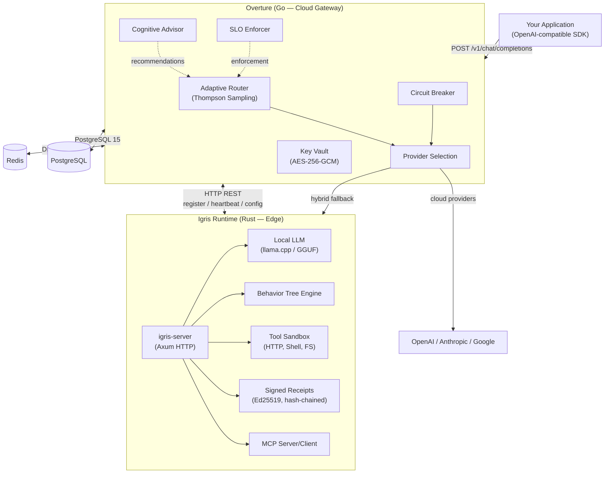

# Architecture

Igris is a governed execution system built from two production binaries: **Overture** (Go API gateway) and **Runtime** (Rust edge engine). Both share the same governance model, trust chain, and OpenAI-compatible API surface.

---

## System Overview

---

## Overture (Go — Cloud Gateway)

Overture is a Go binary built on the Fiber web framework. It runs on your cloud infrastructure (default: Hetzner VPS) and serves as the central API gateway, routing engine, and control plane.

### Core Components

| Component | Package | Purpose |
|---|---|---|
| **Adaptive Router** | `router/` | Thompson Sampling, speculative execution, council mode, cost-aware routing, quality scoring, stream merging |
| **Circuit Breaker** | `router/` | Per-provider failure detection with open/closed/half-open states |
| **Cognitive Advisor** | `cognitive/` | Periodic worker (every 15 min) that analyzes routing performance and proposes optimizations |
| **SLO Enforcer** | `slo/` | Prometheus scraper, audit logger, action executor for latency/cost/quality SLOs |
| **Key Vault** | `security/` | AES-256-GCM encrypted API key storage |
| **Billing** | `billing/` | Polar.sh integration, trial management (7-day), tier enforcement via Redis |
| **Provider Interface** | `providers/` | Pluggable provider implementations (OpenAI, Anthropic, mock, benchmark) |
| **Bandit Algorithm** | `bandit/` | Reward engine for Thompson Sampling |

### Data Layer

- **PostgreSQL 15** — Multi-tenancy, sessions (Better Auth), tenants, API keys, runtime instances, executions, violations, SLO records, billing events, subscriptions
- **Dragonfly/Redis** — Rate limiting, billing state, provider stats cache, semantic classification cache, trial state

### API Surface

Overture exposes:
- **Inference API** — OpenAI-compatible `/v1/chat/completions` with automatic multi-provider routing
- **Management API** — Fleet, policies, receipts, vault keys, routing config
- **Webhooks** — Polar.sh subscription events, alert notifications

---

## Igris Runtime (Rust — Edge Engine)

The Runtime is a Rust workspace of 27 crates compiled into two binaries:

### `igris-server` (Primary Edge Binary)

The main edge runtime — an Axum HTTP server that provides a local OpenAI-compatible API with full governance.

| Crate | Purpose |
|---|---|
| `igris-routing` | Thompson Sampling, speculative execution, council routing |
| `igris-local-llm` | llama.cpp GGUF model inference (local fallback) |
| `igris-btree` | Behavior Tree parser, executor, SSE live streaming |
| `igris-tools` | Tool sandbox: HTTP, shell, filesystem with resource limits |
| `igris-reflection` | Self-critique/reflection agent loops |
| `igris-planning` | Multi-step task planning with tool usage |
| `igris-memory` | Vector store, KV cache, cross-instance context |
| `igris-swarm` | Raft-style leader election, task proposals, consensus |
| `igris-fleet` | Fleet management, config sync, OTA updates |
| `igris-federated` | Federated learning (FedAvg, differential privacy, QLoRA) |
| `igris-lora-trainer` | On-device LoRA fine-tuning |
| `igris-hitl` | Human-in-the-loop approval gates |
| `igris-safety` | Safety checks and capability enforcement |
| `igris-emergency` | EscapeVector encrypted fallback cache |
| `igris-ros2` | ROS2 integration (feature-gated) |
| `igris-sensors` | Sensor integration for robotics |
| `mcp-server` / `mcp-client` | Model Context Protocol with SSE streaming |
| `igris-multimodal` | Vision + audio input (scaffolding) |

**Key capabilities:**
- Ed25519-signed, hash-chained execution receipts
- Cloud provider routing with automatic fallback to local GGUF models
- Behavior Tree execution with live SSE streaming
- Swarm coordination across multiple runtime instances
- Federated learning with privacy-preserving aggregation
- ROS2 topic/service integration for robotics

### `overture-server` (Fleet Control Plane)

A separate, lightweight Axum-based server for fleet management with an embedded Redb database. Handles agent registration, config sync, telemetry collection, and BTree visualization.

---

## Trust Chain

Every execution in Igris is traceable from API call to signed receipt:

<StepChain steps={[
  { label: "Application Request", description: "Initiates with a unique request ID and tenant context" },
  { label: "Overture Gateway", description: "Adaptive Router selects provider via Thompson Sampling, applies SLO and circuit breaker checks" },
  { label: "Execution (Cloud or Edge)", description: "Provider returns response; Runtime applies capability gates and tool sandbox if local" },
  { label: "Signed Receipt", description: "Ed25519 signature over canonical envelope — inputs, outputs, timing, resource usage, violations" },
  { label: "Audit Trail", description: "Hash-chained receipts queryable via API, exportable for compliance, tamper-evident" }
]} />

Each receipt links to the previous via hash chain. Signatures use device-bound keys that cannot be regenerated without the signing key.

[Execution Receipts →](/docs/execution-receipts) · [Governance →](/docs/governance)

---

## Deployment Topologies

**Cloud-only.** Application routes to Overture, which routes to cloud providers. No Runtime deployed. Use for intelligent routing without on-premise infrastructure.

**Hybrid.** Overture handles most requests via cloud providers. When providers fail or policy requires it, traffic routes to a registered Runtime instance. The Runtime registers via HTTP (`POST /api/v1/runtime/register`) and sends heartbeats.

**Edge / offline.** `igris-server` runs directly on device with local GGUF models. No Overture connection required. Full governance (bounded execution, signed receipts, tool sandbox) works offline.

**Fleet.** Multiple Runtime instances coordinated from Overture. Used for robotics, edge deployments, and multi-site production. Config distribution, OTA updates, and health monitoring are managed centrally.

---

## What's Not Production-Ready

The following components exist in the codebase but are not yet wired into the running system:

| Component | Status |
|---|---|
| **gRPC Simatic Layer** | Proto defined, server starts on port 50051, but all 13 RPC methods are stub implementations |
| **NATS InferenceMesh** | Package fully implemented but never initialized in `main.go` |
| **Python ML Service** | `adapters/python/` contains only `pyproject.toml` — zero Python source files |
| **Real provider mode** | OpenAI/Anthropic providers work in benchmark/mock mode; real API call mode is in development |
| **Multi-region routing** | Roadmap item (v1.1.0), not implemented |
| **SAML 2.0 SSO** | Documented but not implemented; only Better Auth with Google/GitHub OAuth |

[Cloud Coordination →](/docs/cloud-coordination) · [Deployment →](/docs/deployment)
