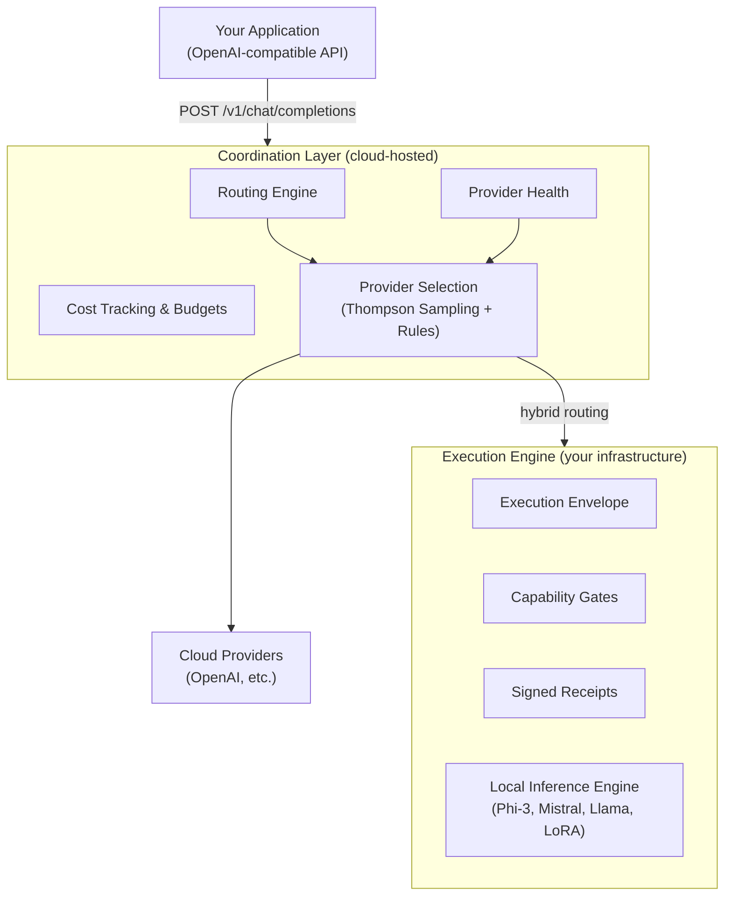
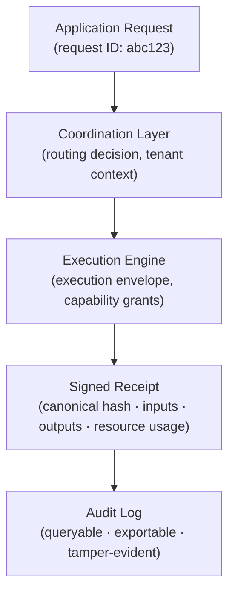

# Architecture

Igris is one execution system. Internally it has two components: a coordination layer that handles cloud routing and policy, and an execution engine that runs on your infrastructure. Both share the same governance model and trust chain.

---

## System Overview

---

## Coordination Layer

The coordination layer is a cloud-hosted service that receives API requests from your application, applies routing and policy, selects where to execute, and returns the response.

### Responsibilities

**Provider selection.** The coordination layer maintains performance statistics for each configured cloud provider. It selects the best provider for each request using Thompson Sampling: a Bayesian algorithm that balances exploration (trying providers to keep statistics current) with exploitation (using the known-best provider).

**Failover.** When a provider returns an error or times out, the coordination layer automatically retries with the next-best provider. This is transparent to your application.

**Cost accounting.** Every request is attributed to a tenant, tracked against monthly budget limits, and returned with cost metadata. Hard limits reject requests before they exceed budget.

**Fleet coordination.** For deployments with multiple execution engine instances, the coordination layer manages configuration distribution, health monitoring, and lifecycle events.

---

## Execution Engine

The execution engine runs on your infrastructure — a server, an edge device, a Kubernetes pod, or a single-board computer. It provides a local OpenAI-compatible API endpoint and governs every execution that passes through it.

### Responsibilities

**Execution envelopes.** Every request processed by the engine is wrapped in a deterministic execution envelope: a structured record of inputs, outputs, timing, resource consumption, and applied capability grants. The envelope is signed cryptographically when execution completes.

**Capability gates.** The engine enforces declared capability limits before and during execution. If an execution attempts to call a tool outside its allowed list, or exceed its resource budget, the engine rejects the operation before it runs.

**Local inference.** The engine embeds a local inference runtime (GGUF-format models). When configured, it falls back to local inference if cloud providers are unavailable. The API and response format remain identical.

**Governance output.** The engine writes signed execution receipts that are queryable via API and exportable for audit workflows.

---

## Trust Chain

The coordination layer and execution engine share a trust model. The coordination layer's routing decision — which provider was selected, for which tenant, at what cost — is linked to the execution engine's signed receipt by a shared request ID.

A request's full lineage — from API call to signed execution — is traceable by request ID.

[Execution Receipts →](/docs/execution-receipts)

---

## Deployment Topologies

**Cloud-only.** Application routes to the coordination layer, which routes to cloud providers. No execution engine deployed. Use when you want intelligent routing without on-premise infrastructure.

**Hybrid.** The coordination layer handles most requests via cloud providers. When providers fail, or when policy requires it, traffic routes to a registered execution engine instance instead.

**Edge / offline.** The execution engine runs directly on device. No coordination layer required. The engine handles routing, inference, and governance locally.

**Fleet.** Multiple execution engine instances coordinated from the cloud layer. Used for robotics, edge deployments, and multi-site production.

[Cloud Coordination →](/docs/cloud-coordination) · [Deployment →](/docs/deployment)
