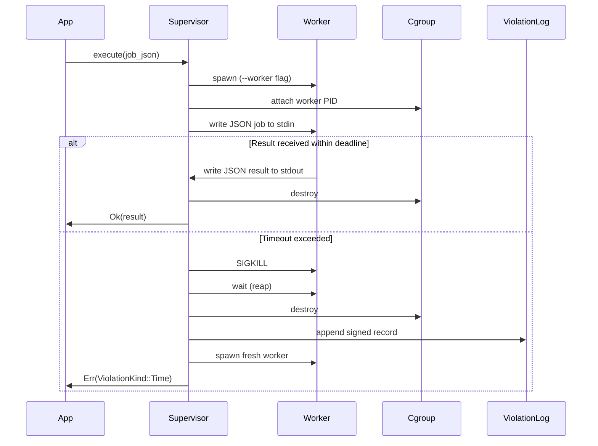

# Containment Model

The runtime enforces hard resource and time limits on inference execution using OS-level process isolation. This page documents the implementation as it exists today.

---

## Why containment exists

Inference on embedded and edge hardware must not starve other processes, hang indefinitely, or consume unbounded memory. The `igris-safety` crate enforces these constraints at the kernel level, not in application code. A misbehaving or slow model cannot bypass enforcement because it runs inside an isolated child process that the supervisor can kill unconditionally.

---

## Supervisor and worker architecture

Every call to `ContainmentGuard::execute` is forwarded to a **worker process** — a separate OS process spawned from the same binary using `std::env::current_exe()` with a `--worker` argument. The **supervisor** (the process that owns `ContainmentGuard`) communicates with the worker exclusively through its stdin and stdout pipes.



No user code executes inside the supervisor process. The supervisor only manages the child lifecycle, IPC, and violation recording.

---

## Resource enforcement

### CPU quota (Linux, cgroups v2)

On Linux, the supervisor creates a cgroup named `igris_worker` and attaches the worker's PID immediately after spawn. The CPU quota is derived from `Bounds::cpu_percent`:

```
quota = (cpu_percent × 100_000 µs) / 100
period = 100_000 µs  (100 ms)
```

The kernel enforces this quota without any cooperation from the worker process. A model consuming 100% of one core with `cpu_percent = 50` will be throttled to half that core.

The cgroup is destroyed after the worker exits, regardless of whether execution succeeded or timed out.

### Memory (reserved)

`Bounds::memory_mb` is communicated to the runtime inside the signed task payload forwarded by Overture. Kernel-level `memory.max` enforcement is not yet wired in the current release. The field exists in the data model and is forwarded correctly.

---

## Execution deadline enforcement

The supervisor wraps the IPC future in `tokio::time::timeout` using `Bounds::max_tick_ms` as the deadline. If the worker does not write a complete JSON response line before the deadline:

1. `tokio::time::timeout` returns `Err(Elapsed)`.
2. The supervisor calls `nix::sys::signal::kill(worker_pid, SIGKILL)`.
3. The supervisor awaits `child.wait()` to reap the process.
4. The cgroup is destroyed.
5. A `ViolationRecord` is created and appended to the JSONL log.
6. A fresh worker is spawned for the next call.
7. `Err(ViolationKind::Time)` is returned to the caller.

SIGKILL cannot be caught or ignored by the worker. The worker has no opportunity to run cleanup code.

---

## Deterministic restart

After any violation the supervisor spawns a new worker before returning the error. The next call to `execute` will use the fresh worker immediately — there is no recovery period or retry delay. Each worker is stateless from the supervisor's perspective: it receives a job, writes a result, and loops. State that must survive worker restarts must live in the supervisor or in external storage.

---

## Signed violation records and hash chain

Each violation writes one JSON line to a configurable JSONL file (default: `./igris_violations.jsonl`). Records are chained: each record includes the SHA-256 hash of the previous record's canonical payload. The chain is signed with an Ed25519 key held by the supervisor.

### Record structure

| Field | Type | Description |
|---|---|---|
| `id` | UUID v7 | Monotonically ordered unique identifier |
| `timestamp` | ISO-8601 UTC | Wall time of the violation |
| `violation_kind` | `"Time"` \| `"Cpu"` | What limit was exceeded |
| `context` | JSON object | Job payload at time of violation |
| `previous_hash` | hex string | SHA-256 of the previous record's payload |
| `hash` | hex string | SHA-256 of this record's canonical payload |
| `signature` | base64 string | Ed25519 signature over `hash` |

### Example record

```json
{
  "id": "0191f4a0-0000-7000-8000-000000000042",
  "timestamp": "2026-02-19T08:00:00.123Z",
  "violation_kind": "Time",
  "context": { "task": "plan_route" },
  "previous_hash": "a3f1...",
  "hash": "b7c2...",
  "signature": "MEQCIBx..."
}
```

The hash chain allows detecting gaps or tampering without trusting the storage layer.

---

## SDK integration

SDK v2.1 surfaces violation events through three methods on `Runtime`:

| Method | Behaviour |
|---|---|
| `get_last_violation()` | Single poll of `GET /v1/runtime/violations`; returns the most recent record or `None` |
| `on_violation(callback)` | Registers a callback; starts a background poller (1 s interval); fires once per unique violation ID |
| `stream_violations()` | Generator / channel that yields new records, polling every second |

Bounds are forwarded to the runtime on every request inside the signed task payload:

```
{
  "containment": {"cpu_percent":40,"memory_mb":512,"max_tick_ms":200}
}
```

**Python example:**

```python
from igris import Runtime, Bounds

runtime = Runtime(
    bounds=Bounds(cpu_percent=40, memory_mb=512, max_tick_ms=200)
)

runtime.on_violation(lambda v: print("violation:", v.violation_kind, v.hash))

resp = runtime.chat({"model": "phi3", "messages": [{"role": "user", "content": "Plan route"}]})
last = runtime.get_last_violation()
```

---

## Platform support

| Platform | CPU cgroup | SIGKILL | Violation log |
|---|---|---|---|
| Linux (cgroups v2) | Enforced | Yes | Yes |
| macOS | Stub (no-op) | Yes | Yes |
| Windows | Not supported | Not supported | Not supported |

On macOS, `attach_cgroup` compiles to a no-op. SIGKILL still fires on timeout via `nix::sys::signal::kill`, which is a POSIX interface available on Darwin. The violation log is written identically on both platforms.

Cgroups v2 is required on Linux. Cgroups v1 is not supported. The kernel feature can be verified with:

```bash
mount | grep cgroup2
# expected: cgroup2 on /sys/fs/cgroup type cgroup2
```

---

## Related

- [Architecture overview](/docs/architecture)
- [Observability](/docs/observability)
- [Configuration](/docs/configuration)
