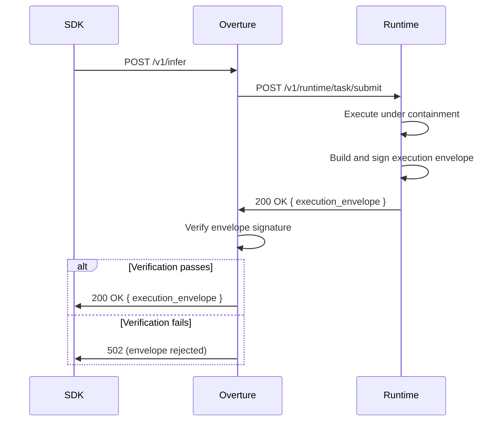

# Execution Envelope

Every inference response produced by a Runtime instance includes a signed execution proof called the **execution envelope**. The envelope records what was executed, when, and by which provider — and is cryptographically signed so that Overture and SDK callers can verify authenticity without trusting the transport layer.

The execution envelope is distinct from a violation record. Violation records capture bound-exceeded events. The execution envelope is the primary proof-of-execution attached to every inference call, whether it succeeded or failed.

---

## Envelope contents

The envelope is returned as a JSON object. The following example represents a completed inference call:

```json
{
  "execution_id": "exec-a1b2c3d4",
  "model": "gpt-4o",
  "routing_decision": "openai",
  "request_hash": "sha256:aabb...",
  "response_hash": "sha256:ccdd...",
  "finish_reason": "stop",
  "timestamp": "2026-02-21T10:00:00Z",
  "signature": "base64:MEQ..."
}
```

| Field | Description |
|---|---|
| `execution_id` | Unique identifier for this execution |
| `model` | Model that handled the request |
| `routing_decision` | Provider the request was routed to |
| `request_hash` | SHA-256 fingerprint of the request payload |
| `response_hash` | SHA-256 fingerprint of the response content |
| `finish_reason` | How execution terminated (`stop`, `length`, etc.) |
| `timestamp` | Wall time of execution completion (ISO-8601 UTC) |
| `signature` | Ed25519 signature over the canonical envelope fields |

---

## Canonical signing

The signature covers a deterministic serialization of the envelope fields, excluding the `signature` field itself. Fields are serialized in a fixed key order, producing a canonical byte sequence. That sequence is SHA-256 hashed, and the hash is signed with the Runtime instance's Ed25519 private key.

This design ensures the signature is independent of JSON field ordering and is fully reproducible by any verifier that holds the corresponding public key.

---

## Verification by Overture

When Overture receives a response from a Runtime instance, it verifies the execution envelope before accepting the result. Verification requires `IGRIS_RUNTIME_PUBLIC_KEY` to be set in Overture's configuration.

When the key is configured, verification proceeds as follows:

1. The `signature` value is base64-decoded.
2. The canonical serialization of the envelope fields is recomputed locally.
3. SHA-256 of that canonical byte sequence is computed.
4. The signature is verified against the hash using the configured public key.
5. If verification fails, Overture returns **502** to the SDK caller. There is no fallback to direct provider routing.

If `IGRIS_RUNTIME_PUBLIC_KEY` is not configured, signature verification is skipped and the envelope is accepted as-is. This is suitable for development and local deployments where Runtime identity assurance is not required.

---

## Lifecycle



---

## Envelope in SDK responses

When verification succeeds, the envelope is included in the API response under the `execution_envelope` key. SDK callers can inspect it for audit, logging, or compliance purposes.

```json
{
  "id": "chatcmpl-xyz",
  "object": "chat.completion",
  "choices": ["..."],
  "execution_envelope": {
    "execution_id": "exec-a1b2c3d4",
    "model": "gpt-4o",
    "routing_decision": "openai",
    "request_hash": "sha256:aabb...",
    "response_hash": "sha256:ccdd...",
    "finish_reason": "stop",
    "timestamp": "2026-02-21T10:00:00Z",
    "signature": "base64:MEQ..."
  }
}
```

The envelope fields are stable across SDK versions. Additional fields may be added in future releases; clients should treat unknown fields as opaque.

---

## Fail-closed behavior

Envelope verification failure is a hard failure. Overture does not retry the request, does not reroute to a different Runtime instance, and does not fall back to direct provider routing. The response to the SDK caller is always **502** when the signature is invalid or cannot be verified.

This ensures that the execution record cannot be substituted or tampered with in transit between Runtime and Overture. A missing or forged envelope is treated the same as a failed one.

---

## Related

- [Containment Model](/docs/architecture/containment)
- [Supervisor Model](/docs/architecture/supervisor-model)
- [Hybrid Execution](/docs/hybrid-execution)
