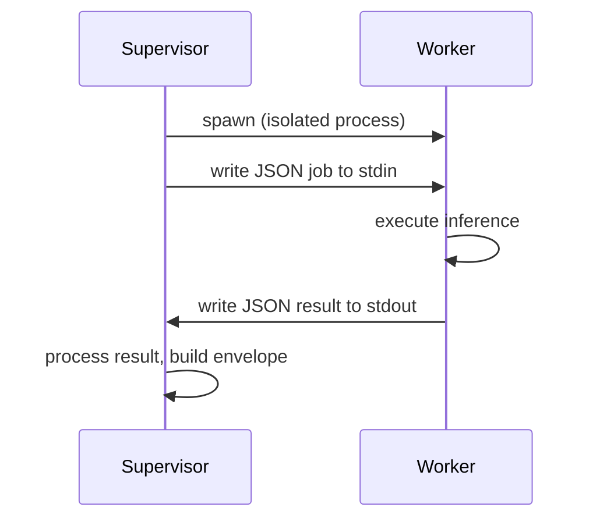

# Supervisor Model

Every inference request executed by a Runtime instance runs inside a **worker process** — a short-lived child process that is fully isolated from the **supervisor process** that manages it. The supervisor spawns workers, routes jobs to them over pipes, enforces deadlines, records violations, and maintains all durable state. Workers execute one job and are discarded after any violation.

This page covers the architectural reasoning and isolation guarantees. For resource enforcement details — CPU quotas, cgroup configuration, and the violation record format — see the [Containment Model](/docs/architecture/containment).

---

## Why this architecture

Running inference inside a worker process rather than in-process provides guarantees that application-level timeouts and try/catch logic cannot:

- A misbehaving or slow model call cannot affect the supervisor. The supervisor's connections, configuration, and violation log remain intact regardless of what happens inside the worker.
- Timeouts are enforced unconditionally. SIGKILL cannot be caught or deferred by the worker process. The operating system delivers it immediately.
- A worker crash — from any cause — does not crash the supervisor. The supervisor detects the exit, records a violation, and continues serving requests.
- Fresh workers start from a clean slate. There is no accumulated state from a previous failed execution.

---

## Isolation guarantees

| Guarantee | Mechanism |
|---|---|
| CPU is bounded | Linux cgroup v2 quota (see Containment Model) |
| Execution can be killed unconditionally | SIGKILL via OS signal |
| Worker crash does not affect service | Worker and supervisor run in separate processes |
| State survives any worker failure | Supervisor holds all durable state |
| No bypass of resource enforcement | Worker has no access to supervisor internals |

---

## Communication model

The supervisor writes the job payload as a single JSON line to the worker's standard input. The worker reads it, executes the inference call, and writes a JSON result to standard output. No other communication channel exists between supervisor and worker.

Because the only channel is stdin/stdout:

- The worker cannot read the supervisor's configuration or environment beyond what is explicitly inherited at spawn time.
- The worker cannot access the violation log.
- The worker cannot reach network resources that the supervisor has not already opened on its behalf.

---

## Violation recording

When a worker exceeds its deadline or CPU quota, the supervisor records a signed violation record before spawning a fresh worker. The violation record includes the full job context so that failed executions remain traceable even after the worker process is gone.

The violation log is append-only and hash-chained — each record includes the SHA-256 of the previous record's payload. This allows detecting gaps or tampering without relying on the integrity of the storage layer. See the [Containment Model](/docs/architecture/containment) for the full record format and field reference.

---

## Restart semantics

After any violation — whether deadline exceeded or CPU quota breach — the supervisor follows a fixed sequence:

1. SIGKILL is sent to the worker process.
2. The supervisor waits for the process to be reaped by the OS.
3. A signed violation record is appended to the log.
4. A fresh worker process is spawned immediately.
5. The next request is served by the fresh worker without delay.

There is no circuit breaker, no backoff, and no recovery period between violations. Each fresh worker starts from a clean state. If a workload triggers repeated violations, each one is recorded independently in the violation log and surfaced through the SDK violation API.

---

## Supervisor state

The supervisor is the only component that holds durable state across worker restarts:

- Active connections to Overture
- Runtime configuration and bounds
- The violation log file handle
- The Ed25519 signing key used for violation records and execution envelopes

None of this state is accessible to the worker process. A worker that exits cleanly, crashes, or is killed does not affect any of these resources.

---

## Related

- [Containment Model](/docs/architecture/containment)
- [Execution Envelope](/docs/architecture/execution-envelope)
- [Observability](/docs/observability)
