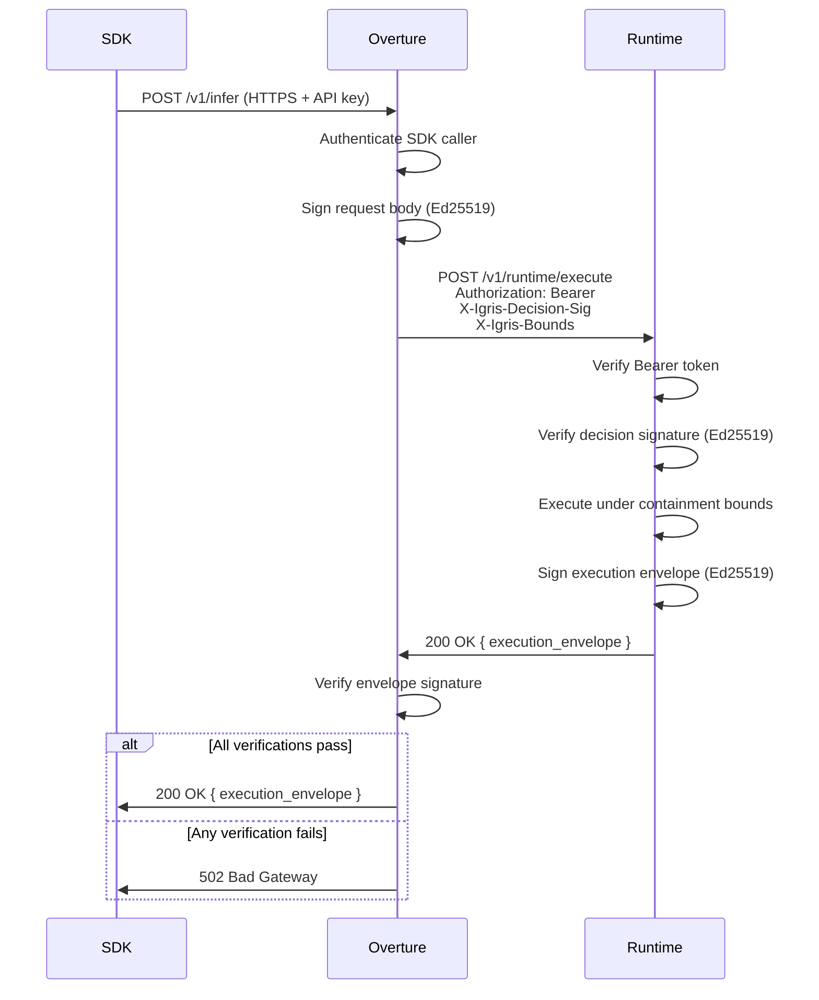

# Trust Chain

When Overture is configured with a Runtime backend, every request passes through a cryptographic trust chain. Each leg of the chain is independently verified. Any failure is a hard rejection — there is no silent fallback to an unverified execution path.

---

## The Six Steps

### Step 1 — SDK to Overture (HTTPS + API key)

The SDK sends the inference request to Overture over TLS. Overture authenticates the caller using the API key or JWT included in the request. Requests that fail authentication are rejected at this step with 401 before any routing work begins.

---

### Step 2 — Overture signs the routing decision

Before forwarding the request to a Runtime instance, Overture signs the JSON request body using its Ed25519 private key, configured via `IGRIS_OVERTURE_SIGNING_KEY`. The resulting signature is attached as the `X-Igris-Decision-Sig` request header.

This signature binds the routing decision to its originating Overture instance. The Runtime can verify that the request came from a legitimate Overture instance and that the body was not altered in transit.

---

### Step 3 — Overture to Runtime

Overture forwards the signed request to the Runtime's `/v1/runtime/execute` endpoint. Three headers are included:

- `Authorization: Bearer <secret>` — the shared secret configured as `IGRIS_RUNTIME_SECRET`
- `X-Igris-Decision-Sig: <base64-signature>` — Ed25519 signature over the request body
- `X-Igris-Bounds: {...}` — containment limits for this execution (CPU, memory, tick deadline)

---

### Step 4 — Runtime verifies both credentials

The Runtime's security layer performs two checks before any inference work begins:

1. Verifies that the Bearer token matches `IGRIS_RUNTIME_SECRET`
2. If `IGRIS_OVERTURE_PUBLIC_KEY` is configured, verifies that `X-Igris-Decision-Sig` is a valid Ed25519 signature over the SHA-256 hash of the request body

Either failure returns 401. The request is rejected unconditionally.

---

### Step 5 — Runtime executes and signs the result

The Runtime executes the request under the OS-level containment bounds specified in `X-Igris-Bounds`. On completion, the Runtime assembles a signed execution envelope containing the response and observed execution metrics. The envelope is signed with the Runtime's own Ed25519 private key, which is generated at startup.

---

### Step 6 — Overture verifies the execution envelope

Overture verifies the execution envelope signature using the configured `IGRIS_RUNTIME_PUBLIC_KEY`. If verification fails, Overture returns 502 to the SDK. There is no retry and no silent fallback to a different provider — an invalid envelope is treated as a security failure, not a routing error.

When verification passes, the execution envelope is forwarded to the SDK in the response body.

---

## Sequence Diagram

---

## Fail-Closed Behavior

The trust chain is fail-closed at every verification step. A failed check does not degrade to an unverified execution path.

| Failure | SDK receives |
|---|---|
| Bearer auth rejected by Runtime | 502 Bad Gateway |
| Decision signature rejected by Runtime | 502 Bad Gateway |
| Execution envelope signature invalid | 502 Bad Gateway |
| Runtime unreachable (timeout, network error) | Falls back to direct provider routing |

The last row is the only case where the request proceeds without Runtime involvement. Connectivity failures are treated as availability issues, not security failures. All cryptographic verification failures are hard-rejected.

---

## Environment Variable Reference

All four variables are required for the full chain to be active. Each is independently optional — see the section below for partial configurations.

| Variable | Side | Purpose |
|---|---|---|
| `IGRIS_RUNTIME_SECRET` | Both | Shared Bearer secret for Overture-to-Runtime authentication |
| `IGRIS_OVERTURE_SIGNING_KEY` | Overture | Ed25519 private key used to sign routing decisions |
| `IGRIS_OVERTURE_PUBLIC_KEY` | Runtime | Overture's Ed25519 public key, used to verify incoming decision signatures |
| `IGRIS_RUNTIME_PUBLIC_KEY` | Overture | Runtime's Ed25519 public key, used to verify execution envelope signatures |

---

## Partial Configurations

Each component of the trust chain is independently optional. The following describes the behavior when individual variables are omitted:

- **Without `IGRIS_OVERTURE_SIGNING_KEY`:** Overture does not attach `X-Igris-Decision-Sig`. The Runtime accepts requests without verifying a decision signature. Bearer auth still applies if `IGRIS_RUNTIME_SECRET` is configured.
- **Without `IGRIS_OVERTURE_PUBLIC_KEY` on the Runtime:** The Runtime does not verify incoming decision signatures. Bearer auth still applies.
- **Without `IGRIS_RUNTIME_PUBLIC_KEY` on Overture:** Overture does not verify execution envelope signatures. The envelope is still forwarded to the SDK.

Bearer auth via `IGRIS_RUNTIME_SECRET` is enforced whenever it is configured, regardless of whether signature verification is active.

---

## Related

- [Execution Envelope](/docs/architecture/execution-envelope)
- [Hybrid Execution Architecture](/docs/architecture/hybrid-execution)
- [Streaming & Enforcement](/docs/architecture/streaming)
